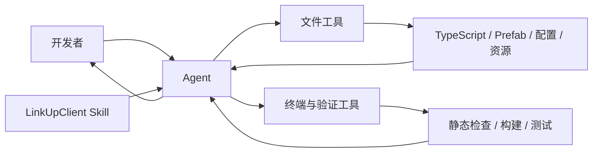
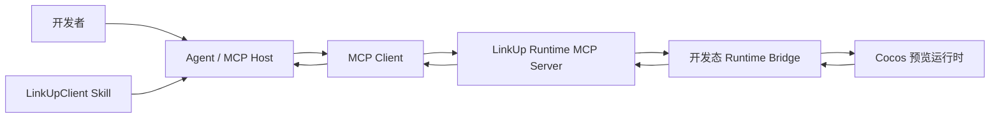
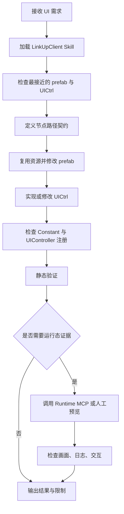

# LinkUpClient Agent、Skill 与 MCP 协作系统设计文档

> 文档状态：设计稿 1.0  
> 编写日期：2026-06-29  
> 适用项目：LinkUpClient  
> 当前事实：项目中不存在 `packages/` 目录，也不存在可运行的 Cocos Inspector 或 MCP Server。

## 1. 摘要

LinkUpClient 当前已经可以通过“开发者 → Agent → Skill → 文件与终端工具”完成代码和 GUI 开发，不需要为了形式完整而立即引入 MCP。

本设计采用渐进式架构：

1. Agent 负责理解目标、规划、修改和验收。
2. Skill 保存 LinkUpClient 的项目知识、约束和标准工作流。
3. Agent 自带的文件与终端工具负责读写 TypeScript、prefab 和配置文件。
4. MCP 仅用于普通文件工具无法访问的外部系统或运行时状态。
5. 如果未来需要观察 Cocos 运行态，再实现独立、只读优先的本地 MCP 与运行时桥接。

核心原则是：**Skill 规定怎么做，MCP 提供做事所需的外部能力，Agent 决定何时做以及是否做对。**

## 2. 背景与现状

### 2.1 项目事实

LinkUpClient 当前技术基线：

- Cocos Creator 2.4.15。
- TypeScript 编译目标为 ES5。
- 竖屏设计，基础分辨率为 `750 × 1334`。
- UI prefab 位于 `assets/BundleLLK/GUI/`。
- UI 控制器位于 `assets/Scripts/UI/`。
- UI 通过 `UIManager` 动态实例化，并在运行时使用 `addComponent` 挂载控制器。
- `UIComponent` 将 prefab 节点完整路径缓存为查询接口，因此节点名称与层级属于代码契约。
- 项目大量使用 Manager 单例、事件分发、运行时组件组合和集中常量。

### 2.2 当前已经具备的能力

Agent 已能直接完成：

- 搜索、读取和修改 TypeScript。
- 解析和修改 Cocos prefab JSON。
- 检查 prefab 节点树。
- 查找资源、UUID 与 `.meta` 文件。
- 运行静态检查、构建命令或项目脚本。
- 对照现有界面和控制器实现新功能。

项目已有 LinkUpClient UI Skill，包含以下关键规则：

- prefab 文件名、根节点名和 `UIName` 必须一致。
- 节点路径是运行时代码 API，不能随意更名或移动。
- UI 控制器默认不预挂在 prefab 中。
- 模态界面使用全屏遮罩和 `cc.BlockInputEvents`。
- 优先复用已有 prefab、字体、图集和特效资源。
- 修改后验证 JSON、节点路径、控制器注册和 TypeScript。

### 2.3 当前不具备的能力

以下能力目前不存在：

- 实时读取 Cocos 运行时节点树。
- 实时读取组件属性和节点状态。
- 自动获取游戏预览截图。
- 自动捕获运行时控制台日志。
- 通过 Agent 控制 Cocos Editor 的预览、暂停或节点定位。
- LinkUpClient 专用 MCP Server。

`docs/cocos-inspector-*.md` 是历史规划文档，不代表当前代码中存在 Inspector 实现。

## 3. 目标与非目标

### 3.1 目标

- 建立开发者、Agent、Skill、工具和可选 MCP 之间的清晰职责边界。
- 让 Agent 按 LinkUpClient 既有风格完成代码与 GUI 修改。
- 让项目知识可以版本化、审查和持续更新。
- 在确有需要时，为 Cocos 运行态提供最小权限的观察能力。
- 所有自动修改都可检查、可回退、可审计。

### 3.2 非目标

- 不重新恢复已删除的 `packages/` 或旧 Inspector。
- 不把所有文件操作重复包装成 MCP。
- 不让 MCP Server 自己规划业务或调用大模型。
- 第一阶段不允许 MCP 修改 prefab 或执行任意 JavaScript。
- 不在生产包中长期开放调试接口。
- 不用 Agent 替代 Cocos Creator 的最终视觉验收。

## 4. 总体架构

### 4.1 当前推荐架构



这条链路已经能覆盖大多数日常开发任务。

### 4.2 可选运行时 MCP 架构

只有当静态文件无法回答问题时，才增加以下链路：



MCP Host 负责管理连接；每个 MCP Client 与一个 MCP Server 建立专用连接。MCP Server 暴露 Tools、Resources 或 Prompts，但不决定 Agent 的业务策略。

## 5. 组件职责

### 5.1 Agent

Agent 是协作系统的总控，职责包括：

- 理解开发者目标和约束。
- 判断是否需要加载 LinkUpClient Skill。
- 从实际代码确认当前实现，不能只依据规划文档。
- 选择文件工具、终端工具或 MCP 工具。
- 制定最小改动方案。
- 修改代码并验证结果。
- 在风险操作前请求确认。
- 汇总改动、验证结果和已知限制。

Agent 不应：

- 把历史文档中的计划描述为现有能力。
- 未检查实际节点路径就修改控制器。
- 为了使用 MCP 而使用 MCP。
- 在没有视觉或运行证据时宣称 UI 已最终验收。

### 5.2 LinkUpClient Skill

Skill 是项目级操作手册，不是外部系统连接器。它应包含：

- 项目目录与关键入口。
- 架构和命名约定。
- GUI 尺寸、分组与遮罩规范。
- prefab 与控制器的运行时契约。
- 常用资源路径。
- 新建界面、修改界面、排查节点路径问题的标准步骤。
- 必须执行的验证清单。
- 明确禁止的做法。

项目事实应优先保存在仓库文档中；个人 Skill 只作为 Agent 的入口和工作流适配层。这样可以避免 Skill 与项目代码长期漂移。

### 5.3 文件与终端工具

这是当前主力执行层：

- 文件搜索和代码阅读。
- prefab JSON 解析。
- 使用补丁修改文件。
- TypeScript 检查。
- 资源和节点路径一致性检查。
- Git diff 和改动范围检查。

这些能力已经存在，不应重复建设一个“文件 MCP”。

### 5.4 MCP Server

MCP Server 只负责稳定暴露外部能力。对 LinkUpClient 而言，合理的 MCP 对象包括：

- Cocos 预览运行时。
- Cocos Editor 状态。
- 游戏后台和玩家数据平台。
- 远程日志或监控平台。
- 关卡配置服务。

MCP Server 不保存 LinkUpClient 的完整开发规范，也不负责决定应修改哪个界面。

### 5.5 Runtime Bridge

Runtime Bridge 是可选的开发态组件，用于把 Cocos 运行时数据交给本地 MCP Server。

它可以负责：

- 序列化当前 Scene 节点树。
- 按 UUID 或稳定路径查询节点详情。
- 转发 `console.log/warn/error`。
- 返回设计分辨率、帧尺寸和安全区信息。
- 响应刷新、暂停和恢复命令。
- 生成或转发预览截图。

Runtime Bridge 不应：

- 接受任意代码执行。
- 在正式构建中默认启用。
- 监听所有网卡。
- 无鉴权接受本机任意进程的写操作。

## 6. 工具选择规则

| 任务 | 首选能力 | 是否需要 MCP |
|---|---|---:|
| 阅读或修改 TS | 文件工具 | 否 |
| 读取或修改 prefab | 文件工具 + prefab tree 脚本 | 否 |
| 检查节点路径是否存在 | 静态 prefab 验证 | 否 |
| 查找可复用资源 | 文件和 `.meta` 搜索 | 否 |
| TypeScript 检查 | 终端工具 | 否 |
| 查看运行时动态节点 | Runtime MCP | 是 |
| 查看运行时组件实时值 | Runtime MCP | 是 |
| 捕获游戏运行日志 | Runtime MCP | 是 |
| 获取实际预览截图 | Runtime MCP 或人工预览 | 可选 |
| 查询线上玩家或关卡数据 | 后台 MCP/API | 是 |
| 创建提交或 PR | Git/GitHub 工具 | 不属于 LinkUp MCP |

判断标准：如果现有文件和命令能够可靠完成任务，就不增加 MCP 依赖。

## 7. 标准工作流

### 7.1 新建或修改 GUI



静态验证至少包括：

- prefab JSON 可解析。
- prefab 文件名与根节点名一致。
- 所有 `getChildByUrl` 和按钮路径存在。
- `UIName`、`UIControllerName` 和控制器注册一致。
- 新资源包含对应 `.meta`。
- TypeScript 不引入明显语法或类型错误。

### 7.2 排查 UI 运行问题

1. Agent 读取相关 prefab、控制器、`UIComponent` 和 `UIManager`。
2. 静态检查节点路径、active 状态、组件类型和按钮注册。
3. 如果静态信息足够，直接给出原因或实施修复。
4. 如果问题只在运行时出现，再请求 Runtime MCP 数据。
5. Agent关联节点树、组件属性、日志和代码定位根因。
6. 修复后重复同一验证流程。

### 7.3 排查玩法逻辑

1. 从 `UIGameUICtrl` 找到运行时组合的子组件。
2. 跟踪事件名和 Manager 状态。
3. 检查 `GameCreate`、`GameTouch`、`WorkFlow`、`HandlerTiles` 及坍塌策略。
4. 优先通过确定性输入和静态测试复现。
5. 只有需要实时棋盘或动画状态时才调用 Runtime MCP。

## 8. Runtime MCP 设计

### 8.1 启动条件

满足以下任一条件时，才进入实现：

- UI 问题频繁依赖运行时节点状态，人工排查成本明显偏高。
- Agent 需要自动读取预览日志或截图形成验收闭环。
- 团队有稳定的自动化回归需求。
- 需要把 Cocos Editor 或运行时能力提供给多个 Agent 客户端。

### 8.2 传输方案

首选本地 `stdio` MCP：

- Agent/MCP Host 以子进程启动 MCP Server。
- 不开放公共网络端口。
- 一个本地 MCP Server 服务一个 MCP Client。
- 日志写入 `stderr`，`stdout` 只输出有效 MCP 消息。

如果 Runtime Bridge 必须通过本地 WebSocket 与 MCP Server 通信：

- 仅绑定 `127.0.0.1`。
- 每次启动生成随机会话令牌。
- 限制允许的消息类型和载荷大小。
- MCP 对外仍使用 `stdio`。

远程或多人共享场景才考虑 Streamable HTTP，并补充 Origin 校验、鉴权、TLS 和审计。

### 8.3 第一版只读 Tools

| Tool | 输入 | 输出 | 风险 |
|---|---|---|---|
| `runtime_status` | 无 | 连接状态、场景、分辨率、帧率 | 低 |
| `runtime_scene_tree` | `maxDepth?` | 精简节点树 | 低 |
| `runtime_node_detail` | `nodeId` | 节点与组件公开属性 | 低 |
| `runtime_console_logs` | `level?`, `limit?` | 最近日志 | 低 |
| `runtime_capture_preview` | `scale?` | PNG 或图像资源引用 | 低 |
| `runtime_pause` | 无 | 当前暂停状态 | 中 |
| `runtime_resume` | 无 | 当前暂停状态 | 中 |
| `runtime_reload` | 无 | 重载结果 | 中 |

第一版明确不提供：

- `eval` 或 `execute_javascript`。
- 任意文件路径读取。
- 任意 shell 命令。
- prefab 回写。
- 节点删除或组件增删。

### 8.4 后续受控写 Tools

只读版本稳定后，可以评估：

| Tool | 约束 |
|---|---|
| `runtime_set_property` | 仅允许白名单属性，仅影响当前运行态 |
| `runtime_toggle_active` | 仅切换节点 active，不保存 prefab |
| `editor_focus_asset` | 只定位资源，不修改资源 |
| `prefab_apply_changes` | 必须展示 diff 并获得明确确认 |

运行时修改与持久化修改必须分开，防止测试操作意外写入 prefab。

### 8.5 Resources 与 Prompts

第一版不必使用 MCP Prompts，因为工作流已经由 Skill 提供。

如果运行时快照需要被多个工具共享，可以提供只读 Resources：

- `cocos://runtime/status`
- `cocos://runtime/scene-tree`
- `cocos://runtime/console`

Resources 应返回结构化、体积受控的数据，避免把完整场景和全部组件一次性塞入 Agent 上下文。

## 9. 目录建议

当前阶段只增加仓库文档，不增加 MCP 代码。

未来实施 Runtime MCP 时建议：

```text
LinkUpClient/
├── assets/
│   └── Scripts/
│       └── Dev/
│           └── AgentRuntimeBridge.ts    # 可选，仅开发构建启用
├── tools/
│   └── linkup-runtime-mcp/
│       ├── package.json
│       ├── tsconfig.json
│       ├── src/
│       │   ├── server.ts
│       │   ├── bridge-client.ts
│       │   ├── tools/
│       │   └── schemas/
│       └── test/
└── docs/
    └── agent-skill-mcp-integration-design.md
```

`AgentRuntimeBridge.ts` 必须通过开发标志启用，并确保不进入正式发布能力面。

## 10. 安全与权限

### 10.1 最小权限

- 默认只读。
- MCP Server 只能访问 LinkUpClient 工作区。
- 不读取 SSH、系统配置、浏览器凭据或其他项目。
- 不提供通用 shell 和通用网络代理。
- 写操作按能力单独授权，不设置“全部访问”权限。

### 10.2 操作确认

以下操作必须在执行前展示范围并确认：

- 保存 prefab。
- 删除节点或资源。
- 修改正式关卡配置。
- 请求线上玩家数据。
- 调用会改变游戏后台状态的接口。

### 10.3 审计

MCP Server 应记录：

- 时间。
- 会话 ID。
- Tool 名称。
- 输入摘要。
- 成功或失败。
- 修改对象。

日志不得记录令牌、用户隐私数据和完整敏感响应。

## 11. 实施阶段

### Phase 0：规范当前 Agent 工作流

状态：可立即执行。

- 以实际项目目录为事实来源。
- 继续完善 LinkUpClient Skill。
- 把稳定项目规则写入仓库文档。
- 使用 prefab tree 脚本检查 GUI。
- 建立节点路径、注册关系和根节点命名检查。

交付结果：不依赖 MCP，也能稳定完成大多数代码和 GUI 任务。

### Phase 1：增强静态验证

- 增加批量 prefab 根节点一致性检查。
- 检查控制器中的节点路径是否存在。
- 检查 `UIName`、prefab 和控制器注册。
- 将验证命令加入 Skill 工作流。

交付结果：在打开 Cocos 前发现大部分结构性错误。

### Phase 2：只读 Runtime MCP

- 实现本地 stdio MCP Server。
- 选择开发态 Runtime Bridge 方案。
- 提供状态、节点树、节点详情、日志和截图工具。
- 建立断线、超时和大数据截断策略。

交付结果：Agent 可以观察运行态，但不能修改运行态或 prefab。

### Phase 3：受控运行态修改

- 增加白名单属性修改。
- 增加 active 切换。
- 所有修改仅作用于当前预览会话。
- 建立修改前后快照与差异。

交付结果：Agent 可以辅助调试布局，但不会直接污染项目资源。

### Phase 4：持久化与外部服务

- 评估 prefab 受控回写。
- 评估关卡后台、日志平台或玩家数据 MCP。
- 引入独立权限、鉴权和审计模型。

交付结果：只在明确收益超过维护成本时扩展。

## 12. 验收标准

### 12.1 当前工作流验收

- Agent 能正确识别项目版本、目录与 UI 架构。
- Agent 不把历史计划文档当作当前实现。
- 新 UI 遵循根节点、`UIName` 和控制器命名一致性。
- 所有控制器节点路径在 prefab 中存在。
- 修改完成后给出实际执行过的验证结果。

### 12.2 Runtime MCP 验收

- MCP Server 可由 Agent Host 通过 stdio 启动和关闭。
- 未连接 Cocos 预览时返回明确状态，而不是挂起。
- 节点树能限制深度和结果体积。
- 日志支持级别和数量过滤。
- 截图不会阻塞主线程或无限占用内存。
- 第一版不存在任意代码执行或持久化写入口。
- 正式构建不启用 Runtime Bridge。

## 13. 风险与应对

| 风险 | 应对策略 |
|---|---|
| Skill 与代码不一致 | 仓库文档作为事实源，Skill 定期对照更新 |
| 历史文档误导 Agent | 明确标记状态，优先检查实际目录和可执行代码 |
| MCP 工具数量膨胀 | 只暴露运行时独有能力，按使用频率评审 |
| 运行时节点树过大 | 深度、节点数、属性白名单和分页限制 |
| 调试接口进入正式包 | 构建标志、打包检查和发布前扫描 |
| Agent 误写 prefab | 默认只读、展示 diff、写操作单独确认 |
| 本地服务被其他进程调用 | stdio 优先；本地桥接使用回环地址和随机令牌 |

## 14. 最终决策

1. 当前不创建 LinkUpClient MCP Server。
2. 当前主链路确定为“Agent + Skill + 文件/终端工具”。
3. 不恢复已删除的 Inspector `packages`。
4. MCP 只作为运行时观察或外部服务接入的可选扩展。
5. 如果实施 MCP，第一版使用本地 stdio、只读工具和最小权限。
6. 项目实际代码优先于计划文档和个人 Skill。

## 15. 参考资料

- [MCP Architecture Overview](https://modelcontextprotocol.io/docs/learn/architecture)
- [MCP Transports](https://modelcontextprotocol.io/specification/2025-06-18/basic/transports)
- [MCP Security Best Practices](https://modelcontextprotocol.io/docs/tutorials/security/security_best_practices)

