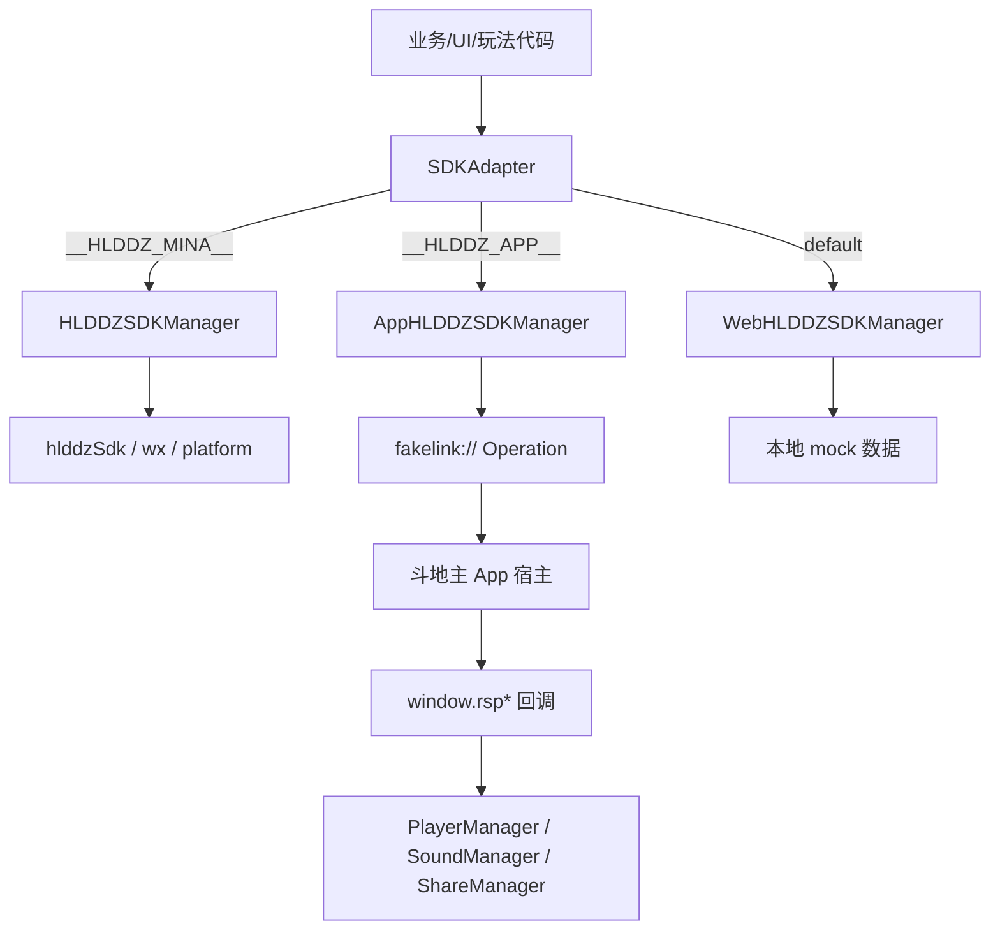
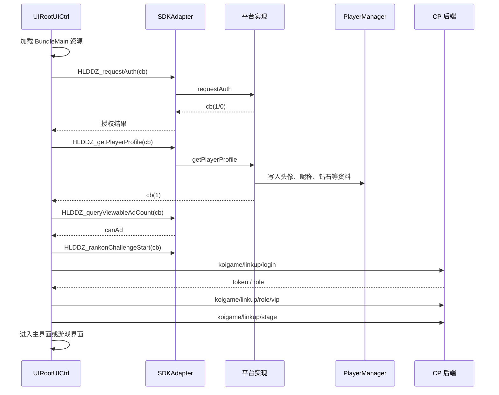
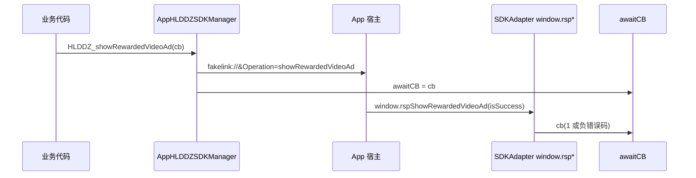

# 欢乐斗地主 CP SDK 接入说明

本文档根据当前连连看客户端代码整理，描述 `SDKAdapter`、小程序 SDK、App 宿主桥接、Web/dev mock 三套实现的接入方式和运行流程。

## 相关代码

| 文件 | 作用 |
| --- | --- |
| `assets/Scripts/SDKAdapter.ts` | SDK 统一入口，根据平台宏选择小程序、App、Web 实现，并注册 App 宿主回调。 |
| `assets/Scripts/HLDDZSDKManager.ts` | 欢乐斗地主小程序环境实现，直接调用 `hlddzSdk`、`wx.getRankManager()`、`wx.vibrateShort()` 等能力。 |
| `assets/Scripts/AppHLDDZSDKManager.ts` | App/H5 容器实现，通过 `fakelink://` 通知宿主，结果由 `window.rsp*` 回调返回。 |
| `assets/Scripts/WebHLDDZSDKManager.ts` | Web/dev 本地 mock 实现，多数接口直接成功回调，便于本地调试。 |
| `assets/sdk/hlddz-sdk.ts` | 本地类型/宏占位文件，声明 SDK 方法和平台宏。实际构建环境会注入对应平台实现。 |
| `assets/Scripts/UI/UIRootUICtrl.ts` | 游戏启动阶段调用 SDK 授权、拉取用户资料、查询广告次数，然后进入游戏登录流程。 |

## 总体架构

业务代码不要直接调用具体平台 SDK，统一通过 `SDKAdapter.getInstance()` 访问。`SDKAdapter` 内部按宏选择对应实现：

```ts
__HLDDZ_MINA__ ? HLDDZSDKManager
    : __HLDDZ_APP__ ? AppHLDDZSDKManager
    : WebHLDDZSDKManager
```

平台宏含义：

| 宏 | 当前用途 |
| --- | --- |
| `__HLDDZ_CP_DEV__` | CP 本地开发环境。`SDKAdapter.isWebDev()` 返回 true。 |
| `__HLDDZ_MINA__` | 欢乐斗地主小程序宿主环境。 |
| `__HLDDZ_APP__` | 欢乐斗地主 App 宿主环境。 |
| `__MINIGAME_STD_MINA__` | 小游戏环境标识，用于判断小程序 PC/Mac 运行态。 |

简化结构：



## 启动接入流程

启动流程主要在 `UIRootUICtrl.start()`、`getPlayerInfo()`、`checkLogin()`、`doLogin()` 中完成。



启动阶段写入的关键字段：

| 字段 | 来源 | 用途 |
| --- | --- | --- |
| `HLDDZ_user.sessionKey` | `requestAuth` | CP 后端登录参数 `session`。 |
| `HLDDZ_user.userid` | `requestAuth` / Web mock | CP 后端登录参数 `openid`。 |
| `netType` | `requestAuth` | 决定 `HttpManager.address` 使用正式服还是测试服。 |
| `canBuyDiamond` | `requestAuth` | 判断是否可走钻石购买能力。 |
| `musicOn` / `soundEffectOn` | `requestAuth` | 同步宿主音效开关到 `SoundManager`。 |
| `extraStr` | `requestAuth` / `getExtraStr` / 分享拉起回调 | 分享进入游戏后的业务跳转参数。 |
| `channelId` / `expStrategies` | `requestAuth` | 后续选择 VIP/实验分组关卡策略。 |
| `avatarUrl` / `nickName` / `diamondCount` | `getPlayerProfile` | 登录、头像加载、钻石显示和支付校验。 |

## 三端实现差异

### 小程序实现

文件：`assets/Scripts/HLDDZSDKManager.ts`

该实现直接调用宿主 SDK：

- `hlddzSdk.requestAuth(10004)` 获取授权信息。
- `hlddzSdk.getPlayerProfile()` 获取玩家头像、昵称、钻石等资料。
- `hlddzSdk.showRewardedVideoAd()` 播放激励广告。
- `hlddzSdk.shareMessage(...)` 调用分享。
- `hlddzSdk.buyDiamond()`、`hlddzSdk.payDiamond(...)`、`hlddzSdk.recommendBuyDiamond(...)`、`hlddzSdk.buyDiamondByShopID(...)` 处理钻石购买和扣钻。
- `wx.getRankManager()` 处理擂台赛排行上报、查询、创建、监听、退出。
- `wx.vibrateShort()` 处理震动。

异步结果通过 SDK 返回对象的 `inspect` / `inspectErr` 分支转为项目内回调：

```ts
myPromise.inspect(() => cb(1));
myPromise.inspectErr(() => cb(0));
```

小程序排行接口：

| Adapter 方法 | 小程序实现 |
| --- | --- |
| `HLDDZ_rankUpdate` | `wx.getRankManager().update()`，当前分数会上报为 `score * 1000`。 |
| `HLDDZ_rankGetScore` | `wx.getRankManager().getScore()`。 |
| `HLDDZ_rankCreateChallenge` | `wx.getRankManager().createChallenge()`。 |
| `HLDDZ_rankonChallengeStart` | `wx.getRankManager().onChallengeStart(cb)`。 |
| `HLDDZ_offChallengeStart` | `wx.getRankManager().offChallengeStart(cb)`。 |
| `HLDDZ_rankmiddleUpdate` | `wx.getRankManager().middleUpdate()`。 |
| `HLDDZ_rankAbort` | `wx.getRankManager().abort()`。 |

### App 宿主实现

文件：`assets/Scripts/AppHLDDZSDKManager.ts`

App 端不直接返回 SDK 结果，而是通过 `jumpUrl()` 拼接并发送 `fakelink://`：

```ts
const shareUrl = `fakelink://${url}`;
```

发送策略：

| 运行环境 | 发送方式 |
| --- | --- |
| PC 宿主 | `window.external.sendGameFakeUrl(shareUrl)` |
| OpenHarmony | `location.href = shareUrl` |
| Android | `confirm(shareUrl)` |
| iOS / iPadOS / macOS | `location.href = shareUrl` |

App 请求发出后，将当前业务回调暂存在模块变量 `awaitCB`。宿主完成操作后调用 `SDKAdapter.ts` 中注册的 `window.rsp*` 函数，`rsp*` 再取出 `AppHLDDZSDKManager.awaitCB` 并执行。



App Operation 对照：

| Adapter 方法 | App Operation / fakelink 参数 | 宿主回调 |
| --- | --- | --- |
| `HLDDZ_requestAuth` | `&Operation=requestAuth` | `rspRequestAuth(...)` |
| `HLDDZ_getPlayerProfile` | `&Operation=getPlayerProfile` | `rspGetPlayerProfile(...)` |
| `HLDDZ_showRewardedVideoAd` | `&Operation=showRewardedVideoAd` | `rspShowRewardedVideoAd(isSuccess)` |
| `HLDDZ_queryViewableAdCount` | `&Operation=queryViewableAdCount` | `rspqueryViewableAdCount(canCPMiniGameAd)` |
| `HLDDZ_buyDiamond` | `&Operation=buyDiamond` | `rspBuyDiamond(isSuccess, curDiamond)` |
| `HLDDZ_payDiamond` | `&Operation=payDiamond&payDiamondId=<id>&billNo=<billNo>` | `rspPayDiamond(result, payDiamondCount, leftDiamond, billno)` |
| `HLDDZ_useDiamondNum` | `&Operation=recommendBuyDiamond&useDiamondNum=<num>` | `rspRecommendBuyDiamond(result, shopid, lacknum, chargePrice, getDiamondNum)` |
| `HLDDZ_buyDiamondByShopID` | `&Operation=buyDiamondByShopID&shopID=<id>` | `rspbuyDiamondByShopID(result, curDiamondNum)` |
| `HLDDZ_shareMessage` | `&Operation=shareMessage&shareId=<shareId>&extraStr=` | `rspShareMessage(shareID, isSuccess)` |
| `HLDDZ_shareMessage2` | `&Operation=shareMessage&shareId=<shareId>&extraStr=<extraStr>` | `rspShareMessage(shareID, isSuccess)` |
| `HLDDZ_backTo` | `&Operation=backToHLDDZ` | 无需业务回调 |
| `HLDDZ_skipGame` | `&Operation=FromCPGameJumpDDZFakeLink&fakeLinkUrlId=25122101` | 无需业务回调 |
| `HLDDZ_OnKeyCodeBackResult` | `&Operation=OnKeyCodeBackResult&action=<ret>` | 无需业务回调 |

App 回调写入逻辑：

| 回调 | 当前代码处理 |
| --- | --- |
| `rspRequestAuth` | 写入 `sessionKey`、`userid`、`netType`、`canBuyDiamond`、音效开关、`extraStr`、`channelId`，同步 `SoundManager`，`result == 0` 时回调 `1`。 |
| `rspGetPlayerProfile` | 写入账号类型、客户端类型、头像、钻石、昵称、`cutWidth`，然后回调 `1`。 |
| `rspShowRewardedVideoAd` | `isSuccess == 0` 回调 `1`，否则回调 `-isSuccess`。 |
| `rspqueryViewableAdCount` | `canCPMiniGameAd == 0` 回调 `1`，否则回调 `0`。 |
| `rspBuyDiamond` | 成功时更新 `diamondCount` 并回调 `1`，失败回调 `0`。 |
| `rspPayDiamond` | 成功时更新 `diamondCount` 并回调 `1`，失败回调 `-result`。 |
| `rspbuyDiamondByShopID` | 成功时更新 `diamondCount` 并回调 `1`，失败回调 `-result`。 |
| `rspRecommendBuyDiamond` | 成功回调 `(1, shopid)`，失败回调 `(-result, 0)`。 |
| `rspCpMiniGameByShare` | 写入 `extraStr`，若已登录则调用 `ShareManager.parseExtraStr()`。 |
| `rspKeyCodeBack` | 发出 `UIController_UIKeyExit`，随后调用 `HLDDZ_OnKeyCodeBackResult(0)` 通知宿主已处理。 |

### Web/dev 实现

文件：`assets/Scripts/WebHLDDZSDKManager.ts`

该实现用于本地开发和浏览器调试：

- 授权直接 `cb(1)`。
- 用户资料写死 `nickName = "test"`、`userid = "test"`。
- 广告、分享、排行默认成功。
- `HLDDZ_payDiamond` 本地扣 `10` 钻。
- `HLDDZ_buyDiamondByShopID` 本地加 `300` 钻。
- `HLDDZ_getSafeArea` 固定返回 `cc.Vec2(90, 40)`。
- `HLDDZ_onEnterFromShareLink` 用 `setTimeout` 延迟调用。

Web/dev 只适合验证 CP 业务流程，不代表宿主 SDK 的真实行为。

## 业务接口说明

### 授权与用户资料

| 方法 | 回调约定 | 当前用途 |
| --- | --- | --- |
| `HLDDZ_requestAuth(cb)` | `1` 成功，`0` 失败 | 启动后第一步，获取 session、openid、网络类型、音效开关、实验参数等。 |
| `HLDDZ_getPlayerProfile(cb)` | `1` 成功 | 获取头像、昵称、钻石数，并在启动、支付轮询、道具弹窗等位置复用。 |
| `HLDDZ_getExtraStr(cb)` | 返回字符串 | 游戏回到前台时读取分享进入参数。 |

游戏自己的登录请求在 SDK 授权和资料获取后发起：

```ts
{
    session: PlayerManager.getInstance().HLDDZ_user.sessionKey,
    name: PlayerManager.getInstance().HLDDZ_user.nickName,
    openid: PlayerManager.getInstance().HLDDZ_user.userid,
    avatar: PlayerManager.getInstance().HLDDZ_user.avatarUrl,
    report: "1-<music>;2-<sound>;3-<shake>"
}
```

### 广告

| 方法 | 回调约定 |
| --- | --- |
| `HLDDZ_queryViewableAdCount(cb)` | `1` 表示可看广告，`0` 表示不可看。 |
| `HLDDZ_showRewardedVideoAd(cb)` | 小程序/Web：`1` 成功、`0` 失败；App：成功 `1`，失败返回负错误码。 |

App 广告错误码在代码中的含义：

| App 返回 | 项目回调 | 含义 |
| --- | --- | --- |
| `0` | `1` | 广告成功观看。 |
| `1` | `-1` | 广告准备中。 |
| `2` | `-2` | 暂无可观看广告。 |
| `4` | `-4` | 玩家提前返回，通常不提示。 |

### 分享

| 方法 | 用途 |
| --- | --- |
| `HLDDZ_shareMessage(id, data, cb)` | 首页、排行、通关、群排行等普通分享。 |
| `HLDDZ_shareMessage2({ id, realShare, extraStr, cb })` | 带 `extraStr` 的助力/残局分享。 |
| `HLDDZ_onEnterFromShareLink(fn)` | 小程序监听从分享链路进入。`SDKAdapter` 当前只在小程序分支调用。 |
| `HLDDZ_showShareRewardsGuide()` | 小程序展示分享奖励引导。 |

`ShareType` 定义在 `Constant.ts`：

| 类型 | 值 | 用途 |
| --- | --- | --- |
| `First` | `1` | 首页分享。 |
| `Rank` | `2` | 排行分享。 |
| `Win` | `3` | 通关分享。 |
| `Fail` | `4` | 失败分享，当前 SDK 实现中未单独映射。 |
| `Share` | `5` | 残局/助力分享。 |
| `Union` | `6` | 群排行分享。 |

小程序分享使用模板名，例如 `LlkFirstPageShare1`、`LlkRankShare1`、`LlkWinShare1`、`LlkHelpShare1`。App 分享使用宿主 shareId，例如首页 `1000401` 到 `1000403`，排行 `1000404` 到 `1000406`，通关 `1000407` 到 `1000409`，助力 `1000413` 到 `1000417`。

### 钻石与支付

| 方法 | 用途 | 成功回调 |
| --- | --- | --- |
| `HLDDZ_buyDiamond(cb)` | 拉起通用充值入口。 | `1` |
| `HLDDZ_useDiamondNum(num, cb)` | 根据缺少钻石数获取推荐充值商品。 | 小程序/App 成功回调 `(1, shopid)`。 |
| `HLDDZ_buyDiamondByShopID(id, cb)` | 按推荐商品 ID 充值。 | `1` |
| `HLDDZ_payDiamond(id, billNo, cb)` | 扣钻购买道具/月卡等。 | `1` |

`PayIDs` 定义在 `Constant.ts`：

| ID 名称 | 值 | 用途 |
| --- | --- | --- |
| `Bag` / `MatchBag` | `10004001` | 常规复活或匹配道具。 |
| `RefreshBag` | `10004002` | 刷新道具。 |
| `CleanBag` | `10004003` | 消除道具。 |
| `Card1` 到 `Card6` | `10001002` 到 `10001007` | 月卡或月卡升级。 |

App 扣钻失败时当前回调为负错误码：

| App 返回 | 项目回调 | 含义 |
| --- | --- | --- |
| `0` | `1` | 扣钻成功，更新剩余钻石。 |
| `1` / `100016` | `-1` / `-100016` | 钻石不足，可引导充值。 |
| 其他 | `-result` | 扣钻失败，应提示重试。 |

### 擂台赛与排行

| 方法 | 用途 |
| --- | --- |
| `HLDDZ_rankUpdate({ scoreKey, score, subScoreKey }, cb)` | 最终分数上报。小程序分数乘 `1000` 后上报。 |
| `HLDDZ_rankmiddleUpdate(...)` | 中途分数上报。 |
| `HLDDZ_rankGetScore(...)` | 查询用户最新分数。 |
| `HLDDZ_rankCreateChallenge(...)` | 创建擂台赛。 |
| `HLDDZ_rankonChallengeStart(cb)` | 监听擂台赛开始。 |
| `HLDDZ_offChallengeStart(cb)` | 移除监听。 |
| `HLDDZ_rankAbort(cb)` | 中途退出擂台赛。 |

当前 App 和 Web 实现中，排行/擂台相关接口大多是日志或直接成功回调，真实排行能力主要在小程序分支。

### 退出、跳转、安全区、震动

| 方法 | 平台行为 |
| --- | --- |
| `HLDDZ_backTo()` | 小程序调用 `hlddzSdk.backToHLDDZ()`；App 发送 `&Operation=backToHLDDZ`；Web 只打日志。 |
| `HLDDZ_skipGame()` | 小程序调用 `hlddzSdk.runFakeLink(...)`；App 发送 `FromCPGameJumpDDZFakeLink`；Web 只打日志。 |
| `HLDDZ_getSafeArea()` | 小程序读取 `cc.sys.getSafeAreaRect()`；App 使用 `cutWidth, 40`；Web 固定 `90, 40`。 |
| `HLDDZ_vibrateShort()` | 小程序调用 `wx.vibrateShort({ type: "heavy" })`；App/Web 当前只打日志。 |
| `HLDDZ_OnKeyCodeBackResult(ret)` | App 发送 H5 返回键处理结果给宿主。 |

## App 回调注册清单

这些函数只在 `__HLDDZ_APP__` 为 true 时挂到 `window`：

```ts
window.rspShowRewardedVideoAd
window.rspqueryViewableAdCount
window.rspRequestAuth
window.rspGetPlayerProfile
window.rspBuyDiamond
window.rspShareMessage
window.rspCpMiniGameByShare
window.rspPayDiamond
window.rspbuyDiamondByShopID
window.rspRecommendBuyDiamond
window.rspKeyCodeBack
```

宿主侧需要保证回调名、参数顺序、成功/失败码与当前代码一致，否则 CP 侧会无法恢复业务流程。

## 接入新 SDK 能力的推荐步骤

1. 在 `SDKAdapter.ts` 增加统一方法，业务代码只调用 Adapter。
2. 在 `HLDDZSDKManager.ts` 实现小程序真实 SDK 调用。
3. 在 `AppHLDDZSDKManager.ts` 增加 Operation，并通过 `jumpUrl()` 发送给宿主。
4. 如 App 能力需要异步结果，在 `SDKAdapter.ts` 的 App 分支注册对应 `window.rsp*` 回调。
5. 在 `WebHLDDZSDKManager.ts` 增加本地 mock，保证 Web/dev 调试不阻塞。
6. 将业务常量优先放入 `Constant.ts`，避免在 UI 或玩法代码中散落魔法值。
7. 修改后至少运行 TypeScript 检查；涉及宿主能力时还需要分别在小程序/App 宿主环境验证。

## 当前代码注意事项

- `AppHLDDZSDKManager.awaitCB` 是单一全局回调槽。App 端如果并发发起两个需要回调的 SDK 请求，后一个会覆盖前一个。业务上应避免并发，或改造为按 Operation/requestId 分发。
- 小程序部分排行方法只在 `platform.isMiniGame()` 为 true 时调用回调；如果该判断为 false，调用方可能一直等待。
- `rspGetPlayerProfile` 中先把 `clientType` 映射成 1/2，随后又直接赋值为宿主原始 `clientType`，前一次映射会被覆盖。
- App 分享实现当前没有使用 `rankName`，小程序分享会把非空 `rankName` 传入 SDK。
- Web/dev 是假实现，钻石、广告、分享、排行结果不能作为线上验收依据。
- 文档中 App Operation 基于当前 `AppHLDDZSDKManager.ts`，如宿主协议有新增字段，应同步更新代码和本文档。

## 验证建议

TypeScript-only 改动可在 `LinkUpClient/` 下执行：

```powershell
npx -p typescript@5.4.5 tsc -p tsconfig.json --noEmit
```

SDK 接入类改动还需要按目标环境验证：

| 环境 | 验证重点 |
| --- | --- |
| Web/dev | 启动、登录、UI 流程、本地 mock 不阻塞。 |
| 小程序宿主 | 授权、用户资料、广告、分享、排行、震动、分享进入。 |
| App 宿主 | fakelink 是否发出、宿主是否回调 `window.rsp*`、支付/广告/返回键错误码是否符合预期。 |

