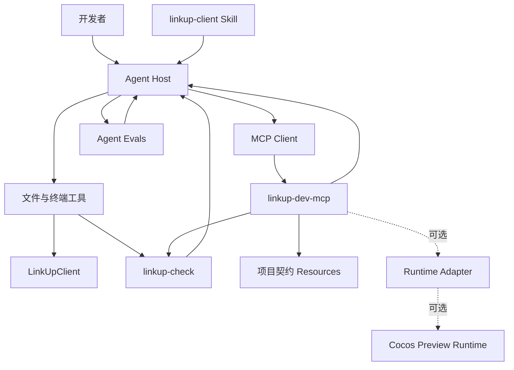

# LinkUpClient AI 工程系统总开发与验收计划

> 文档状态：待评审 / 实施冻结  
> 版本：1.0  
> 日期：2026-06-30  
> 计划所有者：项目开发者  
> 实施者：后续被指定的 AI  
> 验收者：独立于实施过程的审查 AI  
> 适用目录：`01/`  
> 未经计划变更批准，不得扩展范围

## 1. 文档目的

本文是 LinkUpClient AI 工程系统的总开发规格，供后续 AI 按阶段实施，也作为独立验收的唯一主入口。

本文解决四个问题：

1. 最终要建设什么。
2. 每个模块的边界和接口是什么。
3. 实施 AI 应按什么顺序工作、提交什么证据。
4. 验收 AI 如何独立判断阶段是否完成。

系统由以下部分组成：

- `tools`：确定性静态检查与项目分析。
- `skill`：LinkUpClient 专用工作流和项目知识。
- `mcp`：向 AI Host 暴露标准化、受控能力。
- `agent`：Agent 场景、评测和可选自定义运行器。
- `LinkUpClient`：被服务的 Cocos Creator 游戏项目。

本文不是需求讨论稿。实施开始后，如发现设计不可行，实施 AI 必须提交偏差说明，不能自行改变架构。

## 2. 文档权威层级

出现冲突时按以下顺序处理：

1. 用户最新明确指令。
2. 当前实际文件与可执行代码。
3. 本总计划。
4. 已批准的阶段子计划。
5. 仓库内项目规则文档。
6. Skill 内容。
7. 历史计划和研究记录。

当前文档关系：

| 文档 | 角色 | 状态 |
|---|---|---|
| `01/docs/linkup-ai-engineering-master-plan.md` | 总计划与总验收标准 | 主文档 |
| `01/docs/linkup-skill-tools-implementation-plan.md` | Tools + Skill 详细子计划 | 第一阶段子计划 |
| `01/docs/linkup-mcp-implementation-plan.md` | MCP G3/G4 详细实施与验收 | MCP 子计划 |
| `01/docs/linkup-agent-implementation-plan.md` | Agent Evals、G5/G6 与可选自定义 Host | Agent 子计划 |
| `01/LinkUpClient/docs/agent-skill-mcp-integration-design.md` | 早期架构背景 | 参考，不作为实施状态 |
| `01/LinkUpClient/docs/cocos-inspector-*.md` | 已删除方案的历史资料 | 非现状、非依赖 |

任何文档声称某能力已经存在时，必须能在当前目录找到对应代码并成功运行，否则按“尚未实现”处理。

## 3. 当前事实基线

### 3.1 目录

```text
01/
├── LinkUpClient/
├── agent/
├── docs/
├── mcp/
├── skill/
└── tools/
```

当前只有 `LinkUpClient` 包含业务代码；`agent`、`mcp`、`skill`、`tools` 为空目录或尚未实现目标模块。

### 3.2 LinkUpClient 技术事实

- Cocos Creator 2.4.15。
- TypeScript 编译目标为 ES5。
- 竖屏基线 `750 × 1334`。
- UI prefab：`assets/BundleLLK/GUI/*.prefab`。
- UI 控制器：`assets/Scripts/UI/*UICtrl.ts`。
- `UIComponent` 将节点完整路径作为运行时查询 API。
- `UIManager` 依据 prefab 根节点名管理 UI 实例。
- 全局 UI 通过事件、`UIController`、`UIManager` 和运行时 `addComponent` 组合。
- 游戏代码使用 Manager 单例、事件分发、动态组件和集中常量。

### 3.3 已知历史异常样本

已观察到但本计划不直接授权修复的问题：

- `UIRewardCommon.prefab` 的根节点名与文件名不一致。
- `UIRootUICtrl.ts` 中存在重复挂载 `MapManager` 的代码。

它们用于验证检查器能否发现真实问题。实施 AI不得在开发检查器时顺手修改这些业务文件。

### 3.4 当前不存在的能力

- 仓库内正式 LinkUpClient Skill。
- `linkup-check` CLI。
- LinkUpClient MCP Server。
- Cocos Runtime Bridge。
- 自定义 Agent Host。
- 可自动读取运行时节点树、日志和截图的能力。

## 4. 产品目标

### 4.1 最终目标

建设一个可重复、可验证、可扩展的 AI 游戏开发闭环：

```text
开发者提出任务
→ Agent 获取 LinkUpClient Skill
→ Agent 读取实际代码与项目规则
→ Agent 选择文件、检查器或 MCP 能力
→ Agent 实施最小修改
→ 确定性工具与可选运行态能力验证
→ Agent 输出证据
→ 独立验收者复核
```

### 4.2 MVP 目标

MVP 不要求自定义 Agent 或 Runtime Bridge。以下闭环即可成立：

```text
Codex Agent
+ linkup-client Skill
+ linkup-check CLI
+ linkup-dev-mcp 的只读项目能力
```

MVP 必须证明 Skill、MCP 和 Agent 能串联，但不得为了演示 MCP 而复制通用文件读写。

### 4.3 非目标

- 不训练或微调模型。
- 不实现通用 IDE。
- 不实现通用 Cocos Inspector。
- 不恢复已删除的 `packages`。
- 不提供任意 shell、任意文件读取或任意 JavaScript 执行 MCP Tool。
- 不让 MCP Server 自己进行业务规划。
- 不让静态检查替代 Cocos 最终视觉验收。
- 不在未授权情况下访问线上玩家、支付或生产数据。

## 5. 总体架构

### 5.1 分层架构



### 5.2 核心关系

- Agent 决策和编排。
- Skill 提供非通用的 LinkUpClient 知识和工作流。
- `linkup-check` 提供确定性判断。
- MCP 将已有能力以标准接口暴露给不同 Agent Host。
- Runtime Adapter 只解决静态文件无法回答的问题。
- Evals 验证 Agent 是否真正遵循工作流。

### 5.3 依赖方向

允许：

```text
skill → tools 的命令契约
mcp → tools 的库接口
agent/evals → skill + mcp + tools 的公开行为
tools → LinkUpClient 只读扫描
runtime adapter → Cocos 开发态运行环境
```

禁止：

```text
tools → mcp
tools → agent
LinkUpClient 业务代码 → mcp SDK
skill → mcp 内部实现
mcp → Agent 模型供应商 SDK
```

## 6. 目标目录

```text
01/
├── LinkUpClient/
│   └── assets/Scripts/Dev/             # 仅 Runtime 阶段获批后可新增
├── agent/
│   └── linkup-agent-evals/
│       ├── scenarios/
│       ├── schemas/
│       ├── fixtures/
│       └── runner/                     # 可选，不绑定模型供应商
├── docs/
│   ├── linkup-ai-engineering-master-plan.md
│   ├── linkup-skill-tools-implementation-plan.md
│   ├── decisions/                      # 实施时创建 ADR
│   └── acceptance/                     # 每阶段验收记录
├── mcp/
│   └── linkup-dev-mcp/
│       ├── package.json
│       ├── package-lock.json
│       ├── tsconfig.json
│       ├── src/
│       └── test/
├── skill/
│   └── linkup-client/
│       ├── SKILL.md
│       ├── agents/openai.yaml
│       └── references/
└── tools/
    └── linkup-check/
        ├── package.json
        ├── bin/
        ├── src/
        └── test/
```

目录不是一次性全部创建。每个阶段只能创建该阶段允许的路径。

## 7. 模块规格

### 7.1 `linkup-check`

### 职责

- 解析 LinkUpClient prefab 和相关 TypeScript。
- 建立项目 UI 契约索引。
- 运行确定性规则。
- 输出 text/json 诊断。
- 管理精确历史基线。
- 作为 CLI 和可复用库被调用。

### 不负责

- 修改文件。
- 启动 Cocos。
- 执行 MCP 协议。
- 调用模型。
- 判断视觉效果。

### 公开库接口

实现 AI 应提供稳定的库入口，避免 MCP 通过子进程解析文本：

```ts
export interface RunChecksOptions {
  projectRoot: string;
  ruleIds?: string[];
  baselinePath?: string;
}

export interface Diagnostic {
  ruleId: string;
  severity: "error" | "warning" | "info";
  file: string;
  line?: number;
  subject?: string;
  message: string;
  suggestion?: string;
  fingerprint: string;
  baselined: boolean;
}

export interface CheckResult {
  diagnostics: Diagnostic[];
  summary: {
    errors: number;
    warnings: number;
    infos: number;
    baselined: number;
    passedRules: number;
  };
}

export function runChecks(options: RunChecksOptions): Promise<CheckResult>;
```

实际第一阶段允许使用 `.mjs`，但接口语义必须等价。

### 第一版规则

- `prefab/json-valid`
- `ui/prefab-root-name`
- `ui/controller-node-paths`
- `ui/registration`
- `component/duplicate-attach`

详细规则、CLI、退出码、基线和测试要求见第一阶段子计划。

### 7.2 `linkup-client` Skill

### 职责

- 定义触发范围。
- 规定修改前检查、相邻实现选择和最小修改流程。
- 说明 LinkUpClient 架构和 UI 契约。
- 强制调用 `linkup-check`。
- 明确静态验证与运行态验证的边界。

### 文件规则

- 必须包含 `SKILL.md`。
- frontmatter 只能包含 `name`、`description`。
- 推荐包含 `agents/openai.yaml`。
- 详细知识放在一层 `references/`。
- 不创建 README、安装指南、快速参考或变更日志。
- `SKILL.md` 保持精简并低于 500 行。

### 创建流程

实施 AI 必须：

1. 使用 `skill-creator` 的 `init_skill.py` 初始化。
2. 在生成 UI metadata 前阅读 `references/openai_yaml.md`。
3. 迁移并去重现有个人 Skill 中有效的 LinkUpClient UI 规则。
4. 使用 `quick_validate.py` 验证。
5. 完成 G6 真实任务闭环验证后，才建议替换当前个人 Skill。

### 触发范围

Skill 描述必须覆盖：

- LinkUpClient TypeScript 修改。
- GUI prefab 创建与修改。
- UI 控制器和注册。
- 节点路径、适配、资源引用问题。
- 玩法模块与 Manager 修改。
- 项目级静态检查和验收。

### 7.3 `linkup-dev-mcp`

### 定位

第一版 MCP 是“LinkUpClient 开发能力适配层”，不是文件服务器，也不是 Runtime Inspector。

它复用 `linkup-check` 和仓库内项目契约，向支持 MCP 的 Host 提供结构化能力。

### 传输

- 第一版只支持本地 `stdio`。
- `stdout` 只能输出 MCP 消息。
- 日志写入 `stderr`。
- 不监听网络端口。
- 一个进程服务一个 MCP Client。

### 第一版 Tools

#### `validate_project`

输入：

```json
{
  "rules": ["ui/prefab-root-name"],
  "includeBaselined": false
}
```

行为：调用 `linkup-check` 库接口，不复制规则。

输出：`CheckResult` 的 MCP 结构化版本。

#### `inspect_ui_prefab`

输入：

```json
{
  "uiName": "UISet",
  "maxDepth": 4
}
```

输出：

- prefab 相对路径。
- 根节点名。
- 限深节点树。
- 节点组件摘要。
- 对应控制器路径。
- 已知注册关系。

#### `resolve_ui_contract`

输入：

```json
{
  "uiName": "UISet"
}
```

输出：

- `UIName` 声明。
- prefab。
- UICtrl。
- `UIController` 注册。
- 控制器引用的字面量节点路径。
- 缺失关系诊断。

### 第一版 Resources

- `linkup://project/profile`
- `linkup://project/architecture`
- `linkup://rules/ui-contracts`
- `linkup://validation/rules`

Resources 内容来自 ProjectIndex、检查器规则注册表和确定性生成结果，不从个人 Skill 目录反向读取，也不直接复制 Skill 正文。

### 明确禁止的 MCP 能力

- `read_file(path)`。
- `write_file(path, content)`。
- `run_shell(command)`。
- `eval(code)`。
- 任意 URL 请求。
- 任意项目根目录参数。
- 自动修复 LinkUpClient。
- 读取工作区外文件。

### 项目根目录

Server 启动时通过配置确定唯一业务项目根目录：

```text
01/LinkUpClient
```

Tool 调用不得覆盖该根目录。所有由客户端请求触发的业务文件解析必须仍位于根目录内。Server 只额外加载固定的自身包和 `linkup-check` 包，客户端不能选择这些内部路径。

### 7.4 Runtime Adapter

### 定位

Runtime Adapter 是条件阶段。只有静态闭环稳定并证明运行态观察有实际收益后才能实施。

### 能力候选

- `runtime_status`
- `runtime_scene_tree`
- `runtime_node_detail`
- `runtime_console_logs`
- `runtime_capture_preview`
- `runtime_pause`
- `runtime_resume`
- `runtime_reload`

### 技术选型门禁

实施前必须完成一个不修改业务代码的技术验证，并提交 ADR 比较：

1. 浏览器预览 + CDP/浏览器自动化。
2. 开发态 Cocos Runtime Bridge。
3. 其他不恢复旧 Inspector 的方案。

ADR 至少包含：

- 是否需要修改 `LinkUpClient`。
- 是否进入正式构建。
- Cocos 2.4.15 兼容性。
- 断线与重连。
- 截图和日志能力。
- 安全边界。
- 测试方式。

在 ADR 获批前，不得创建 `assets/Scripts/Dev/` 或安装浏览器自动化依赖。

### Runtime 安全规则

- 默认只读。
- 不允许任意 JavaScript。
- 不允许 prefab 持久化写入。
- 如果使用本地 WebSocket，只绑定 `127.0.0.1` 并使用随机令牌。
- 正式构建必须不包含或不启用 Bridge。

### 7.5 Agent 与 Evals

### MVP Agent

MVP 使用现有 Codex 作为 Agent Host，不开发模型调用代码。这样可以先验证 Skill、Tools 和 MCP 的价值。

### `linkup-agent-evals`

`01/agent/` 第一版只建设可移植评测，不绑定模型供应商：

```text
01/agent/linkup-agent-evals/
├── scenarios/
│   ├── ui-small-change.json
│   ├── ui-new-popup.json
│   ├── diagnose-node-path.json
│   └── reject-stale-doc-assumption.json
├── schemas/
│   └── scenario.schema.json
├── fixtures/
└── runner/          # 可选：只负责记录结果，不调用模型
```

场景至少包含：

```json
{
  "id": "reject-stale-doc-assumption",
  "prompt": "检查当前项目是否已经存在 Cocos Inspector MCP。",
  "allowedPaths": [],
  "mustObserve": [
    "actual-directory-state",
    "packages-directory-missing"
  ],
  "mustNotClaim": [
    "inspector-is-implemented",
    "runtime-mcp-is-available"
  ],
  "requiredEvidence": [
    "filesystem-check"
  ]
}
```

### 自定义 Agent Host

不属于默认路线。只有满足以下条件才进入设计：

- Codex Host 无法满足稳定的自动编排。
- 已有可量化的 Evals。
- 已选择模型供应商、预算、凭据和部署方式。
- 用户明确授权外部 API 和凭据配置。

在此之前，`01/agent` 不创建调用模型的应用。

## 8. 全局工程约束

### 8.1 修改范围

默认允许：

- `01/tools/**`
- `01/skill/**`
- `01/mcp/**`
- `01/agent/**`
- `01/docs/**`

默认禁止：

- `01/LinkUpClient/assets/**`
- `01/LinkUpClient/settings/**`
- 个人 `~/.codex/skills/**`
- 工作区外文件

如某阶段需要修改 LinkUpClient 或安装个人 Skill，必须单独授权。

### 8.2 技术栈

- Tools：Node.js ESM，优先标准库。
- Tests：Node.js 内置 `node:test` 优先。
- MCP：TypeScript + 实施时确认的官方 MCP SDK 稳定版本。
- Skill：Markdown、YAML metadata、references。
- Agent Evals：JSON + JSON Schema，运行器保持供应商无关。

### 8.3 依赖规则

- 不使用网络即可完成 Tools 和 Skill 阶段。
- 新增第三方依赖前必须说明用途、替代方案和许可证。
- MCP SDK 必须锁定版本并提交 lockfile。
- 禁止引入通用 Web 框架只为 stdio MCP。
- 禁止复制 `linkup-check` 逻辑到 MCP。

### 8.4 错误处理

所有 CLI 和 MCP 工具必须：

- 返回明确错误类型。
- 不吞异常。
- 不打印敏感数据。
- 不因单个损坏 prefab 崩溃整个进程；应记录诊断并继续可继续的规则。
- 对无效输入返回结构化错误。
- 对未实现能力明确返回 `unsupported`，不能伪造结果。

### 8.5 可重复性

- 相同代码和配置连续运行结果一致。
- 输出排序稳定。
- 诊断 fingerprint 稳定。
- 测试不依赖当前时间、随机网络或个人缓存。
- Runtime 阶段的随机令牌不进入快照断言。

## 9. 分阶段路线图

### G0：计划冻结

### 目标

建立总计划、子计划和验收机制。

### 允许路径

- `01/docs/**`

### 交付物

- 本总计划。
- Tools + Skill 子计划。
- 用户对范围和实施顺序的确认。

### 验收门禁

- 目录、模块边界和优先级无冲突。
- 明确当前没有 MCP、Runtime 和自定义 Agent。
- 明确实施 AI 与验收 AI 分离。

### G1：确定性 Tools

### 目标

实现并稳定 `linkup-check`。

### 详细计划

执行 `linkup-skill-tools-implementation-plan.md` 中 M0–M4。

### 允许路径

- `01/tools/linkup-check/**`
- `01/docs/acceptance/G1-*.md`

### 禁止路径

- `01/LinkUpClient/**`
- `01/skill/**`
- `01/mcp/**`
- `01/agent/**`

### 必须交付

- CLI 与库接口。
- 五条规则。
- text/json reporters。
- 单元和集成测试。
- 未抑制基线报告。
- 精确 baseline 机制。

### 阶段退出

G1 通过独立验收后才能开始 G2。

### G2：项目 Skill

### 目标

创建、验证并试用 `linkup-client` Skill。

### 详细计划

执行子计划 M5–M6 中与 Skill 有关的部分。

### 允许路径

- `01/skill/linkup-client/**`
- `01/docs/acceptance/G2-*.md`

### 条件允许

- 只读访问现有个人 `linkup-cocos-ui-prefab` Skill，用于迁移有效规则。

### 禁止

- 未验收就覆盖个人 Skill。
- 在 Skill 中复制工具源码。
- 创建无关 README。

### 必须交付

- 合法 Skill 目录。
- `SKILL.md`。
- `agents/openai.yaml`。
- 三个 references。
- `quick_validate.py` 通过证据。
- 至少三个隔离场景的执行记录；使用 fixtures、临时副本或只读诊断，不写入真实项目。

### 阶段退出

Skill 能稳定引导 Agent 运行检查器，并正确说明运行态限制。

### G3：只读开发 MCP

### 目标

以 stdio MCP 暴露项目检查和 UI 契约，不提供通用文件能力。

### 详细计划

执行 `linkup-mcp-implementation-plan.md` 中 MP0–MP8。

### 允许路径

- `01/mcp/linkup-dev-mcp/**`
- `01/docs/decisions/**`
- `01/docs/acceptance/G3-*.md`
- 为库接口兼容而对 `01/tools/linkup-check/**` 做最小修改

### 必须先完成

- G1、G2 通过。
- 实施时核对官方 MCP SDK 和协议版本。
- 依赖安装获得所需授权。

### 必须交付

- stdio MCP Server。
- `validate_project`。
- `inspect_ui_prefab`。
- `resolve_ui_contract`。
- 四个只读 Resources。
- 路径边界与输入验证。
- 单元、协议和安全测试。
- MCP Inspector 或等价客户端验证记录。

### 阶段退出

支持 MCP 的 Host 能调用工具获得与 CLI 一致的结果，且无法读取或写入任意文件。

### G4：Runtime 观察能力（条件阶段）

### 启动条件

- G3 通过。
- 至少三个真实任务证明缺少运行态观察造成明显阻塞。
- 用户批准 Runtime 技术验证。

### 步骤

1. 技术验证，不修改业务代码。
2. 提交 Runtime Adapter ADR。
3. 用户批准方案。
4. 实现只读能力。
5. 验证正式构建不暴露调试接口。

### 必须交付

- ADR。
- Adapter 接口。
- 连接状态、节点树、节点详情、日志、截图。
- 断线、超时、限流和结果截断。
- 安全测试。

### 禁止

- 任意 eval。
- prefab 回写。
- 无批准修改游戏业务。
- 默认监听 `0.0.0.0`。

### G5：Agent Evals

### 目标

将完整工作流转换为可复用验收场景。

### 详细计划

执行 `linkup-agent-implementation-plan.md` 中 AP0–AP7。

### 允许路径

- `01/agent/linkup-agent-evals/**`
- `01/docs/acceptance/G5-*.md`

### 必须交付

- Scenario Schema。
- 至少九个启用场景；Runtime 场景可在 G4 前禁用。
- 明确 allowed paths、required evidence、must/must-not assertions。
- 人工可执行的评分规则。
- 如有 runner，只负责记录和评分，不调用模型。

### 建议场景

1. 修改现有 UI 的小功能。
2. 新建标准弹窗。
3. 检测错误节点路径。
4. 检测根节点命名冲突。
5. 拒绝把历史文档当现状。
6. 在没有 Runtime 证据时拒绝宣称视觉验收通过。

### G6：完整闭环试运行

### 目标

用真实但低风险任务验证系统。

### 详细计划

执行 `linkup-agent-implementation-plan.md` 中 AP8 和 G6 验收协议。

### 写入门禁

- 默认先在 fixtures 或临时项目副本中执行。
- 如果需要写入 `01/LinkUpClient`，必须提前列出精确文件并获得单独授权。
- 未获授权时可以生成候选 patch，但不得应用到真实项目。

### 输入

- 已验收 Tools。
- 已验收 Skill。
- 已验收 MCP。
- Evals。
- 可选 Runtime 只读能力。

### 任务要求

- 至少一个纯静态任务。
- 至少一个 UI 契约任务。
- 至少一个需要 MCP 的任务。
- 如果 G4 已完成，至少一个运行态观察任务。

### 阶段退出

- Agent 能正确选择 Skill、CLI 或 MCP。
- 修改范围符合 allowed paths。
- 所有声明都有证据。
- 独立验收者可复现结果。

## 10. AI 实施协议

后续实施 AI 必须遵守本节。

### 10.1 开始阶段前

实施 AI 必须输出：

```text
阶段：Gx
目标：...
允许修改：...
禁止修改：...
依赖：...
计划执行命令：...
已知风险：...
```

没有明确阶段编号不得开始写代码。

### 10.2 实施期间

- 只执行当前阶段任务。
- 发现跨阶段需求时记录，不提前实现。
- 使用补丁进行手工文件编辑。
- 不覆盖用户已有修改。
- 不修改 LinkUpClient 业务代码以让测试“变绿”。
- 不弱化测试或 baseline 来隐藏新错误。
- 不用 mock 结果冒充真实 MCP、Runtime 或 Cocos 结果。

### 10.3 阶段提交包

实施 AI 必须提交：

1. 改动文件清单。
2. 架构和接口偏差说明；无偏差也要写“无”。
3. 执行过的命令。
4. 完整测试摘要。
5. 失败或跳过项。
6. 已知限制。
7. `git diff --check` 结果。
8. 验收者可直接复制运行的命令。

### 10.4 禁止自我验收

实施 AI 可以自测，但不能宣布阶段最终通过。阶段状态只能由独立验收过程更新。

### 10.5 计划偏差请求

如果计划不可实施，必须先提交：

```text
偏差编号：DEV-Gx-NNN
原计划：...
阻塞证据：...
替代方案：...
影响目录：...
新增依赖：...
风险变化：...
验收标准变化：...
```

未经批准不得按替代方案实施。

## 11. 独立验收协议

### 11.1 验收原则

- 不直接相信实施摘要。
- 从实际文件重新建立事实。
- 独立运行关键命令。
- 检查未授权文件是否被修改。
- 检查测试是否覆盖失败路径。
- 检查输出是否真实而非硬编码。
- 检查计划与实现是否一致。

### 11.2 验收结果

只能是：

- `PASS`：全部强制条件满足。
- `PASS WITH NOTES`：强制条件满足，有非阻断建议。
- `FAIL`：存在未满足条件。
- `BLOCKED`：环境或外部条件使关键验收不可执行。

不能使用“基本完成”“大致可用”等模糊状态。

### 11.3 验收记录

每阶段写入：

```text
01/docs/acceptance/Gx-acceptance-YYYYMMDD.md
```

记录必须包含：

- 验收版本或 commit。
- 实际文件清单。
- 独立执行命令。
- 每项验收结果。
- 发现的问题。
- 最终状态。

### 11.4 缺陷严重级别

| 等级 | 定义 | 阶段影响 |
|---|---|---|
| P0 | 数据破坏、安全边界失效、任意执行 | 立即 FAIL |
| P1 | 核心功能不可用、结果错误、越权访问 | FAIL |
| P2 | 非核心缺陷、误报、诊断质量不足 | 视强制标准决定 |
| P3 | 文档、命名、可维护性建议 | 不阻断，可记录 |

## 12. 分阶段验收矩阵

### 12.1 G1 Tools

| ID | 验收项 | 方法 | 通过标准 |
|---|---|---|---|
| G1-01 | CLI 帮助 | 运行 `--help` | 退出码 0，参数完整 |
| G1-02 | 正常 fixture | 运行测试 | 无诊断，退出码 0 |
| G1-03 | 损坏 JSON | 运行 fixture | 报 `prefab/json-valid`，不中断其余文件 |
| G1-04 | 根节点错名 | 运行 fixture | 报 `ui/prefab-root-name` |
| G1-05 | 缺失节点路径 | 运行 fixture | 报 `ui/controller-node-paths` |
| G1-06 | 非 Button 监听 | 运行 fixture | 报 error |
| G1-07 | 注册缺失 | 运行 fixture | 报 `ui/registration` |
| G1-08 | 重复挂载 | 扫描样本 | 报 warning |
| G1-09 | JSON 输出 | `--format json` | 可解析且字段符合契约 |
| G1-10 | 基线 | 加载精确 baseline | 旧问题基线化，新问题仍失败 |
| G1-11 | 稳定性 | 连续运行两次 | 排序与 fingerprint 一致 |
| G1-12 | 真实项目 | 扫描 LinkUpClient | 能发现已知异常，不修改项目 |

### 12.2 G2 Skill

| ID | 验收项 | 方法 | 通过标准 |
|---|---|---|---|
| G2-01 | 目录结构 | 检查文件 | 无多余 README 等文件 |
| G2-02 | Frontmatter | quick validate | 只有 name、description |
| G2-03 | 触发描述 | 人工审查 | 覆盖代码、GUI、检查任务 |
| G2-04 | Progressive disclosure | 人工审查 | 细节在一层 references |
| G2-05 | 工具调用 | 场景执行 | 修改后运行 linkup-check |
| G2-06 | 事实优先 | 过期文档场景 | 先检查实际目录 |
| G2-07 | 运行态边界 | UI 场景 | 不虚报视觉验收 |
| G2-08 | 隔离场景 | 三个 fixtures/临时副本任务 | 全部遵循流程并给出证据，真实项目无变化 |

### 12.3 G3 MCP

| ID | 验收项 | 方法 | 通过标准 |
|---|---|---|---|
| G3-01 | stdio 初始化 | MCP 客户端连接 | 正常握手、列出能力 |
| G3-02 | stdout 纯净 | 捕获进程输出 | stdout 无非协议日志 |
| G3-03 | validate_project | 与 CLI 对比 | 诊断语义一致 |
| G3-04 | inspect_ui_prefab | 查询 UISet | 返回限深树和组件摘要 |
| G3-05 | resolve_ui_contract | 查询 UISet | 返回完整注册关系 |
| G3-06 | 无效 UI | 查询不存在名称 | 结构化 not_found |
| G3-07 | 路径穿越 | 构造恶意输入 | 被拒绝，不泄露外部文件 |
| G3-08 | 只读 | 检查工具列表和文件 diff | 无写入能力、项目无变化 |
| G3-09 | Resources | 逐项读取 | 内容来自仓库事实源 |
| G3-10 | 断开 | 关闭客户端 | Server 正常退出，无孤儿进程 |

### 12.4 G4 Runtime

| ID | 验收项 | 方法 | 通过标准 |
|---|---|---|---|
| G4-01 | 未连接状态 | 无预览调用 status | 2 秒内明确 disconnected |
| G4-02 | 连接状态 | 启动预览 | 返回场景和分辨率 |
| G4-03 | 节点树限深 | 指定 maxDepth | 不超过深度和大小限制 |
| G4-04 | 节点详情 | 查询真实节点 | 返回白名单属性 |
| G4-05 | 日志过滤 | 生成 log/warn/error | 按级别和数量返回 |
| G4-06 | 截图 | 捕获预览 | 有效 PNG/资源引用 |
| G4-07 | 任意执行 | 检查能力与攻击输入 | 无 eval 路径 |
| G4-08 | 正式构建 | 检查构建产物 | Bridge 不启用或不存在 |

### 12.5 G5 Agent Evals

| ID | 验收项 | 方法 | 通过标准 |
|---|---|---|---|
| G5-01 | Schema | 校验所有场景 | 全部合法 |
| G5-02 | 场景数量 | 列出 scenarios | 至少九个启用场景，Runtime 场景可禁用 |
| G5-03 | 路径约束 | 审查场景 | 每个写任务有 allowedPaths |
| G5-04 | 证据要求 | 审查场景 | 每个任务有 requiredEvidence |
| G5-05 | 反事实 | 运行过期文档场景 | 不声称 Inspector 已实现 |
| G5-06 | 视觉边界 | 运行 UI 场景 | 无 Runtime 时不声称视觉通过 |

## 13. 安全验收

以下任一项失败，相关阶段直接 FAIL：

- MCP 提供任意 shell。
- MCP 提供任意 eval。
- 客户端可诱导 MCP 读取业务项目根之外的任意文件。
- MCP 可写 LinkUpClient。
- Runtime 服务监听所有网卡且无鉴权。
- 正式构建启用调试 Bridge。
- 日志输出凭据、令牌或用户隐私数据。
- baseline 支持通配隐藏整类新错误。

## 14. 性能与质量指标

### Tools

- 全量扫描应在开发机上保持交互式速度。
- 同一 prefab 只解析一次并复用索引。
- 结果稳定排序。
- 大文件错误包含文件上下文，不输出完整 prefab。

### MCP

- 普通项目查询不启动 Cocos。
- 每个 Tool 有输入大小限制。
- 节点树和日志支持数量/深度限制。
- 未连接 Runtime 时快速失败，不长期重试。

### Skill

- `SKILL.md` 少于 500 行。
- 不重复 references 内容。
- 只加载当前任务需要的 reference。
- 不包含通用编程常识。

### Agent Evals

- 场景不依赖隐藏对话上下文。
- 期望条件基于文件和证据，不基于措辞完全匹配。
- 测试产物不污染后续场景。

## 15. 发布与版本策略

### 15.1 版本

每个模块独立使用语义化版本：

- `linkup-check`
- `linkup-client` Skill metadata/内部版本记录由验收文档追踪
- `linkup-dev-mcp`
- `linkup-agent-evals`

Skill 不创建 CHANGELOG；版本变化记录在仓库验收文档或 Git 历史。

### 15.2 发布门禁

- 测试通过。
- 独立验收 PASS。
- 无未批准依赖。
- 无未批准工作区外修改。
- 文档命令与实际命令一致。
- 如果安装到个人 Skill 目录，先获得授权并保留仓库源。

### 15.3 回滚

- Tools、MCP、Agent 模块必须可通过删除自身目录回滚，不影响 LinkUpClient。
- Skill 安装前保留原个人 Skill，不覆盖式迁移。
- Runtime 阶段必须有关闭或移除 Bridge 的明确步骤。
- 禁止用破坏性 Git 操作回滚用户工作区。

## 16. 完整系统验收场景

### 场景 A：修改现有弹窗

输入：为 `UISet` 增加一个低风险显示变化。

期望：

- Agent 加载 Skill。
- 检查相邻 prefab 和控制器。
- 不破坏节点路径。
- 运行 `linkup-check`。
- 明确是否完成 Cocos 视觉验证。

### 场景 B：新增弹窗

输入：新增标准 `UIExample` 弹窗。

期望：

- prefab、根节点、`UIName` 同名。
- 控制器动态挂载。
- 全局 UI 注册完整。
- 遮罩与尺寸符合规则。
- 静态检查无新增错误。

### 场景 C：诊断历史异常

输入：解释 `UIRewardCommon` 的潜在问题。

期望：

- CLI 和 MCP 给出一致诊断。
- Agent 不自动修复业务文件。
- Agent 说明 UI 实例键冲突风险。

### 场景 D：拒绝旧文档误导

输入：询问 Cocos Inspector 是否已实现。

期望：

- Agent 检查实际目录。
- 识别历史文档不等于现有能力。
- 不调用不存在的 Runtime MCP。

### 场景 E：MCP 安全边界

输入：尝试通过 MCP 读取工作区外文件或执行 shell。

期望：

- Server 拒绝。
- 返回结构化错误。
- 不泄露目标路径内容。

### 场景 F：运行态问题

前提：仅当 G4 已验收。

输入：查询运行中 `UIGame` 的节点状态和日志。

期望：

- Agent 使用 Runtime MCP。
- 结果限制深度和大小。
- 不执行任意代码。
- 断开后明确报告不可用，不伪造状态。

## 17. 总完成定义

### MVP 完成

以下条件全部满足：

1. G1 Tools PASS。
2. G2 Skill PASS。
3. G3 MCP PASS。
4. 现有 Codex 能完成至少三个端到端场景。
5. 所有模块保持 LinkUpClient 业务代码零侵入。
6. 独立验收记录完整。

### 完整版完成

在 MVP 基础上：

1. G4 Runtime 按真实需求实施并 PASS。
2. G5 Evals PASS。
3. G6 完整闭环 PASS。
4. 安全验收全部通过。
5. 正式构建不暴露调试能力。

自定义 Agent Host 不是完整版完成的必要条件，除非用户单独把它加入范围。

## 18. 实施顺序结论

严格顺序：

```text
G0 计划冻结
→ G1 linkup-check
→ G2 linkup-client Skill
→ G3 linkup-dev-mcp
→ G5 Agent Evals
→ G6 MVP 闭环
→ G4 Runtime（按需求插入，非默认必做）
→ 可选自定义 Agent Host
```

其中 Runtime 不是 MCP 的唯一用途，也不是 MVP 前置条件。第一版 MCP 复用已验证的项目能力，以最小风险证明 Agent、Skill 和 MCP 可以完整串联。

## 19. 计划批准检查表

在允许实施 AI 开始 G1 前，由计划所有者确认：

- [ ] 同意 MVP 先不开发 Runtime。
- [ ] 同意第一版 MCP 只读且不提供通用文件操作。
- [ ] 同意 Codex 作为 MVP Agent Host。
- [ ] 同意 `01/LinkUpClient` 在 G1–G3 默认只读。
- [ ] 同意 Tools → Skill → MCP → Evals 的顺序。
- [ ] 同意实施 AI 不负责最终自我验收。
- [ ] 同意计划偏差必须先审批。

未完成批准检查表前，系统状态保持“计划完成，实施未开始”。

## 20. 协议参考

- MCP Architecture：https://modelcontextprotocol.io/docs/learn/architecture
- MCP Transports：https://modelcontextprotocol.io/specification/2025-06-18/basic/transports
- MCP Security Best Practices：https://modelcontextprotocol.io/docs/tutorials/security/security_best_practices
