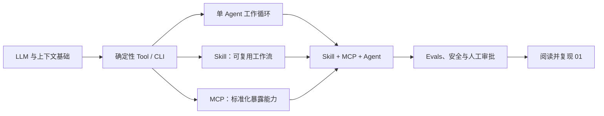

# Agent、Skill、MCP 从零学习路线

这套路线按你的实际情况设计：已有编程经验，但没有 Agent、Skill、MCP 相关知识。目标不是补通用编程基础或先背框架 API，而是建立一条能解释、能动手、能验证的 AI 工程能力链，最终读懂并能安全扩展 `01` 中的 LinkUpClient AI 工程系统。

## 先说结论

建议按下面的依赖顺序学习：

不要从多 Agent、长期记忆、RAG 或复杂编排开始。`01` 的实际依赖也是：先有确定性的 `linkup-check`，再由 Skill 描述工作流，由 MCP 暴露能力，最后通过 Agent 场景和 Evals 验证整体行为。

## 学习周期

- 标准节奏：第 0 周用 2～3 小时校准 Node.js/TypeScript 工具链，随后 9 周每周 6～8 小时。
- 加速节奏：每周 12～15 小时，可压缩到 5～6 周，但阶段验收不能跳过。
- 如果你已熟悉 Node.js、npm scripts、异步 JavaScript/TypeScript、JSON Schema 和自动化测试，第 0 周可以直接跳过。
- 第 0～7 周不要求自行开发付费 API 应用；使用现有 Codex、本地 Node.js 和玩具项目即可。
- 第 8 周以后如果选择 Agents SDK 实现分支，才需要单独配置 API 凭据和预算。

## 文档导航

1. [00-学习地图.md](./00-学习地图.md)：先弄清概念、边界和前置知识。
2. [01-十周学习计划.md](./01-十周学习计划.md)：每周学什么、做什么、如何验收。
3. [02-实验清单.md](./02-实验清单.md)：从玩具实验到组合闭环的动手任务。
4. [03-01项目阅读指南.md](./03-01项目阅读指南.md)：按正确顺序阅读 `01`，避免一开始陷入细节。
5. [04-学习检查表.md](./04-学习检查表.md)：记录进度，只在有证据时勾选。

## 当前课程包

- [第 1 周：LLM、上下文与工具调用基础](./week01-LLM与工具调用基础/README.md)

## 完成后的能力

完成路线后，你应该能独立做到：

- 用自己的话解释 Agent、Skill、Tool、MCP、Evals 的职责和边界。
- 先写一个可独立测试的确定性工具，再决定是否需要 Skill 或 MCP。
- 编写能稳定触发、按需加载资料、调用现有工具的 Skill。
- 实现一个最小 MCP Server，区分 Tools、Resources、Prompts，并理解 Host、Client、Server。
- 为工具设计输入 Schema、结构化错误、路径边界、日志和测试。
- 设计一个“观察—计划—执行—验证—报告”的单 Agent 闭环。
- 用场景、断言和证据评估 Agent，而不是凭一次演示判断成功。
- 顺着一次请求读懂 `01` 中 Tool → Skill/MCP → Agent Eval 的调用和验证链。

## 学习规则

每个主题都遵守四步：

1. **先解释**：不看资料也能用 3～5 句话说清职责。
2. **再实现**：在 `02/work/` 中做最小实验，不直接修改 `01`。
3. **再破坏**：主动测试错误输入、越权路径、缺失文件和工具失败。
4. **再举证**：保留命令、测试结果、输入输出样例和复盘记录。

只有“能跑”不算学会；能说明为什么这样分层，并能证明失败时仍然安全，才算通过。

## 权威资料入口

- [Codex customization：AGENTS.md、Skills、MCP 的关系](https://developers.openai.com/codex/concepts/customization)
- [Codex Agent Skills](https://developers.openai.com/codex/skills)
- [Codex MCP 配置与使用](https://developers.openai.com/codex/mcp)
- [OpenAI Agents SDK 学习入口](https://developers.openai.com/api/docs/guides/agents)
- [MCP 架构](https://modelcontextprotocol.io/docs/learn/architecture)
- [MCP 规范](https://modelcontextprotocol.io/specification/)

资料用于校准概念和当前接口；真正的掌握标准以本目录中的实验和验收证据为准。
