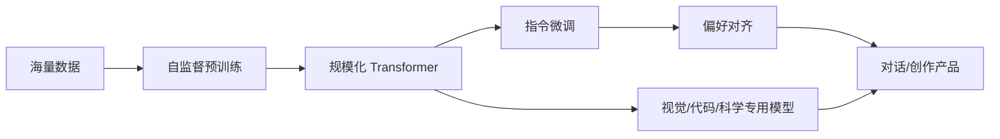

# 2022 技术深度：从基础模型到生成式产品

## 先给出结论

2022 年的技术跃迁可以概括为一条连续的工程链：

“大模型”只是中间环节。真正改变产品体验的是：预训练得到通用表示，微调让模型理解任务，偏好优化让输出更符合人类期待，最后再由推理服务、过滤器和交互界面把能力交付给用户。

## 1. 语言模型：从“预测下一个词”到“完成任务”

### 1.0 预训练是什么？

**预训练（Pre-training）**就是先让模型在海量通用数据上学习基础能力，再针对具体用途进行微调。

以语言模型为例，训练数据可以包括网页、书籍、论文、代码和对话。模型会看到一段文本，并尝试预测下一个 token：

> 今天天气很____

模型需要预测“好”“冷”“热”等可能的后续词。它反复处理数万亿个 token，通过不断调整参数，逐渐学会词语关系、语法、文本结构、代码模式和部分事实关联。

预训练通常不需要人工逐条标注答案，因为原文中的下一个 token 就可以作为训练目标，这种方式叫**自监督学习**。它的基本流程可以表示为：

预训练、微调和对齐不是一回事：

| 阶段 | 主要问题 | 结果 |
|---|---|---|
| 预训练 | 语言和世界中的模式是什么？ | 获得通用语言能力 |
| 指令微调 | 用户的任务应该怎样完成？ | 学会遵循指令和组织回答 |
| 偏好对齐 | 哪种回答更有帮助、更安全？ | 更符合人类偏好的助手行为 |

因此，ChatGPT 并不是一开始就被训练成聊天机器人。它先通过预训练学会语言，再经过指令微调和人类反馈训练，才变得适合多轮对话。

需要注意的是，预训练的核心目标是预测文本延续，而不是验证事实或形成可靠的知识数据库。因此，模型可能生成非常流畅、看起来合理但实际错误的内容；这也是后续检索、工具调用、人工反馈和事实核验仍然重要的原因。

### 1.0.1 ChatGPT 是“超级搜索引擎”吗？

把 ChatGPT 称为“一个会总结的搜索”很适合作为产品层面的比喻，但从技术上看，它和搜索引擎有明显区别：

| 对比 | 搜索引擎 | 2022 年发布的 ChatGPT |
|---|---|---|
| 信息来源 | 实时抓取、索引并检索网页 | 预训练阶段学习过的参数，以及当前对话中的输入 |
| 生成方式 | 返回或排序已有网页 | 根据概率逐 token 生成新的回答 |
| 时效性 | 可以随着网页更新 | 默认不会实时知道新发生的事情 |
| 引用能力 | 通常可以给出网页链接 | 2022 年版本默认不提供实时来源核验 |
| 主要优势 | 找到原始资料 | 对问题进行解释、改写、归纳和连续对话 |

因此，更准确的描述是：**ChatGPT 是一个经过大规模预训练、能够进行对话式生成和总结的语言模型；它在没有联网工具时，不是实时搜索引擎。**

“把全球的数据整合”也需要改成更严谨的说法。训练数据是经过收集、筛选和处理的文本、代码等资料的集合，不等于全世界的全部数据；模型也不是把每篇文章原封不动存进数据库，而是把训练过程中学到的统计规律压缩进参数。用户提问时，系统主要是在模型参数中生成回答，所以能快速响应，但也可能混淆事实、遗漏来源或产生幻觉。

ChatGPT 真正带来的变化，是把搜索、问答、写作和总结统一成了一个自然语言接口：用户不必先设计关键词、打开多个网页，再手动归纳，而可以直接描述目标并连续追问。这个体验后来又与联网搜索、检索增强生成（RAG）和工具调用结合，逐渐形成今天的 AI 助手形态。

### 1.0.2 2022 年的 AI 能理解和编写代码吗？

能，但当时更准确的定位是**高级代码助手**，还不是可以独立操作整个项目的软件工程 Agent。

2022 年前后，GPT-3/Codex、GitHub Copilot、ChatGPT 和 AlphaCode 已经展示了以下能力：

- 解释代码和 API 的基本作用；
- 根据自然语言生成 Python、JavaScript、Java、C++ 等代码；
- 编写脚本、SQL、正则表达式和简单网页；
- 根据报错信息提出修复建议；
- 在不同编程语言之间进行翻译；
- 为函数生成简单测试或示例输入输出；
- 在竞赛编程中生成大量候选程序，再通过测试筛选。

但“理解代码”需要加引号。模型主要是从大量自然语言和代码中学习模式，并不保证真正理解业务目标、运行环境和所有隐含约束。它可能生成语法正确但逻辑错误的实现，也可能调用不存在的库函数。

| 2022 年的代码能力 | 主要限制 |
|---|---|
| 能生成函数和小型脚本 | 不一定能理解大型项目的整体架构 |
| 能解释常见代码和报错 | 解释可能听起来合理但实际错误 |
| 能根据要求修改代码 | 默认不能自动运行、测试和验证修改 |
| 能补全常见 API 用法 | 可能使用过时或不存在的 API |
| 能解决部分算法题 | 复杂任务需要人工拆解和检查 |

因此，2022 年 AI 已经能够“写代码”，但还不能稳定地完成“读需求—改文件—运行测试—定位失败—持续迭代”的完整开发闭环。这个闭环要等到代码解释器、终端工具、代码库检索、自动测试和 Agent 编排逐步结合后才真正形成。

### 1.1 预训练的基本目标

PaLM、GPT-3、Chinchilla、BLOOM 等模型都属于以 Transformer 为核心的自回归语言模型。给定 token 序列 `x₁, x₂, …, xₜ`，训练目标是最大化：

`P(xₜ | x₁, x₂, …, xₜ₋₁)`

工程上通常使用交叉熵损失，把互联网文本、书籍、代码和其他语料切成 token 后，让模型反复预测下一个 token。模型并没有被直接告知“什么是答案”，而是在预测任务中逐渐学到语法、事实关联、代码模式和文本结构。

这种目标的优势是数据规模容易扩大，缺点是“能续写”不等于“能完成用户任务”：基础模型可能生成流畅但无关、虚构或有害的内容。

### 1.2 Scaling Law 的修正：不只是堆参数

PaLM 把规模推到 540B 参数，代表了 2022 年初“扩大模型”的路线；Chinchilla 则指出，过去许多模型相对于训练算力来说参数过多、训练 token 太少。DeepMind 用 70B 参数、约 1.3T tokens 的模型证明：在相近训练计算预算下，更合理的数据—参数配比可以超过更大的模型。

这带来三个直接影响：

1. **训练阶段**：预算不能只用于增加参数，还要增加高质量 token。
2. **推理阶段**：更小但训练充分的模型更容易降低显存、延迟和服务成本。
3. **模型规划**：模型规模、数据量和算力需要一起设计，不能把参数量当作能力的单一代理指标。

### 1.3 In-context learning 与“涌现能力”

大语言模型可以在不更新参数的情况下，从 prompt 中读取示例并临时改变输出方式，这就是 in-context learning。2022 年的研究还广泛讨论“涌现能力”：某些任务在小模型上近似随机，规模增大后突然改善。

这里要谨慎：能力曲线是否真正不连续，会受到指标选择、任务格式和评价方法影响。因此，更稳妥的表述是“规模提高让更多复杂任务达到可用区间”，而不是认为模型在某个参数阈值突然获得了人类式理解。

## 2. 指令微调与 RLHF：让模型听懂人话

### 2.1 InstructGPT 的三阶段配方

InstructGPT 把“预训练模型”和“可用助手”之间的差距拆成三个阶段：

| 阶段 | 输入 | 学到的东西 | 典型目标 |
|---|---|---|---|
| SFT（监督微调） | 人工撰写的 prompt—answer 示范 | 任务格式、回答风格和基本遵循能力 | 模仿高质量示范 |
| RM（奖励模型） | 人类对多个回答的排序 | 把“人更喜欢哪个回答”压缩成标量分数 | 学习偏好函数 |
| PPO（强化学习） | 模型生成的回答 + 奖励模型分数 | 让策略模型朝偏好方向更新，同时限制偏离原模型 | 最大化偏好奖励 |

可以把它理解为：先教模型“答案长什么样”，再教一个评委“哪个答案更好”，最后让模型反复练习争取评委高分。论文报告中，1.3B 的 InstructGPT 在人工偏好评价中可以胜过 175B 的 GPT-3，说明“对齐”与“扩大参数”是两条不同的能力轴。

### 2.2 RLHF 的技术代价与边界

RLHF 并不是让模型变得全知全能。它优化的是标注者偏好，因而容易出现：

- 更会说“听起来正确”的话，但不一定更接近事实；
- 对标注者和提示分布之外的任务泛化有限；
- 过度拒答、迎合用户或钻奖励模型漏洞；
- 为了安全与风格牺牲部分原始模型能力，即所谓 alignment tax。

这解释了为什么 ChatGPT 仍会犯简单错误：对齐改善的是交互行为和风险边界，不等于建立了可靠的外部知识库或形式化推理器。

### 2.3 Constitutional AI：把部分监督写成原则

Anthropic 在 2022 年提出 Constitutional AI（CAI），将一组关于有害、诚实和有帮助的原则写成“宪法”。模型先生成回答，再根据原则自我批评和改写；随后用这些 AI 评价训练偏好模型，再做 RLAIF（reinforcement learning from AI feedback）。

CAI 的技术意义不是“完全不需要人”，而是把人工监督从逐条标注有害回答，转移到设计、审查和更新原则。它提高了监督的可扩展性，也把价值选择显式化，但原则本身仍然带有设计者的文化和规范取向。

## 3. 文本到图像：扩散模型为什么在 2022 年爆发

### 3.1 从加噪到去噪

扩散模型训练时逐步向真实图像加入噪声，得到接近高斯噪声的状态；模型学习反向过程，在给定文本条件的情况下逐步去噪，最终生成图像。

简化表示为：

`真实图像 → 加噪过程 → 噪声`

`噪声 + 文本条件 → 反向去噪网络 → 图像`

与早期 GAN 相比，扩散模型通常更稳定、覆盖模式更完整，但采样要执行多轮去噪，因此推理速度和计算量是重要工程问题。

### 3.2 Latent Diffusion：把计算从像素空间搬到潜空间

Latent Diffusion Models（LDM）先用 VAE 把高分辨率图像压缩成较小的 latent，再在 latent 上执行扩散，最后用解码器还原图像。这样既保留了语义结构，又显著降低了 U-Net 每一步处理的空间尺寸。

文本条件通过 cross-attention 注入去噪网络：图像 latent 作为 query，文本编码作为 key/value，模型由此学习“哪些文字对应图像的哪些区域”。这一设计成为 Stable Diffusion 系列的重要基础。

### 3.3 三种路线的差异

| 系统 | 文本理解 | 生成路径 | 2022 年的技术位置 |
|---|---|---|---|
| DALL·E 2 | CLIP 文本/图像表示 | 在 CLIP latent 上预测，再由扩散解码器生成 | 闭源、强调质量与分阶段安全部署 |
| Imagen | 冻结的大型 T5 文本编码器 | 级联扩散与超分辨率 | 证明更强文本编码器能显著提高语义对齐和画面质量 |
| Stable Diffusion | 文本编码器 + cross-attention | VAE latent 中的扩散 U-Net | 权重和生态开放，降低本地运行与二次开发门槛 |

因此，2022 年的突破不只是“图片更好看”，而是形成了两种产品化路线：闭源 API 通过控制访问和过滤器管理风险，开放模型通过社区扩散能力，但同时扩大了版权、滥用和内容审核压力。

## 4. 多模态：Flamingo 如何把视觉接入语言模型

Flamingo 的核心思路不是从零训练一个“看图聊天模型”，而是尽量复用已有的视觉模型和语言模型：

1. 视觉编码器把图像或视频帧变成视觉特征。
2. Perceiver Resampler 把数量可变的视觉 token 压缩成固定长度表示。
3. 在冻结语言模型的若干层之间插入 gated cross-attention，让文字 token 有选择地读取视觉信息。
4. 用交错的图像、视频和文本序列训练，使模型支持 few-shot 的视觉问答和描述。

这种“冻结大模块，只训练连接器”的思路很重要：它降低了多模态训练成本，也为后来的视觉投影层、适配器和多模态指令微调提供了架构范本。局限也很明显：视觉理解依赖训练数据，模型仍会看错物体、数字和空间关系；它更像视觉条件下的语言生成器，而不是可靠的视觉测量系统。

## 5. 代码和科学文本：生成能力开始接触“可验证任务”

### 5.1 AlphaCode：先大量生成，再执行筛选

AlphaCode 不把代码生成简化为一次 greedy decoding，而是：

1. 根据题目自然语言生成大量候选程序；
2. 用测试样例执行候选程序，淘汰无法通过的代码；
3. 对候选进行聚类和去重，保留多样的高潜力解；
4. 输出少量最有希望的程序。

它在竞赛编程中达到接近中位参赛者的水平，关键不只是 Transformer 变大，还包括大规模采样、执行反馈和搜索策略。这预示了后来“模型 + 工具 + 验证器”的路线：当答案可以运行或检查时，系统可以用外部反馈弥补语言模型的不可靠。

### 5.2 Galactica：流畅的科学文本仍可能是错的

Galactica 针对论文、参考文献和科学知识训练，尝试生成科学摘要、公式和研究文本。它的公开演示很快暴露了一个根本问题：模型能生成具有科学外观的句子，却不能保证引用存在、结论正确或证据充分。

这不是“科学语料不够多”的简单问题，而是自回归模型的训练目标本来就是预测文本延续，不是验证命题真伪。2022 年因此留下一个重要技术原则：在高风险知识场景，应把检索、引用校验、程序执行或形式化验证接入生成流程。

## 6. 开放模型：开放的不只是权重

BLOOM 是 2022 年开放模型的重要样本：176B 参数、ROOTS 语料覆盖 46 种自然语言和 13 种编程语言，并通过 BigScience 的协作方式公开训练过程、数据说明和模型卡。

它的意义有三层：

- **研究层**：更多团队可以复现实验，而不是只能调用少数公司的 API。
- **语言层**：多语种模型把英语之外的语言纳入基础模型竞争。
- **治理层**：开放权重并不自动等于开放治理，数据许可、使用限制、硬件门槛和责任边界仍需说明。

Stable Diffusion 在图像领域产生了类似效果。模型一旦能够下载并本地运行，社区就可以做 LoRA、界面、插件、风格微调和工作流组合；与此同时，审核与追责不再集中在单一平台。

## 7. 训练与部署：研究论文背后的系统工程

2022 年的大模型竞争也推动了系统层面的进步：

- **数据并行**：不同设备处理不同 batch，再同步梯度。
- **张量/流水线并行**：把一个巨大 Transformer 拆到多个加速器上。
- **混合精度**：用较低精度减少显存和通信成本，同时保持训练稳定。
- **检查点与容错**：数周级训练必须能从故障中恢复。
- **推理优化**：KV cache、批处理和量化成为降低每次生成成本的基础手段。

PaLM 的 Pathways 方向、Chinchilla 对训练算力的分析以及 Stable Diffusion 对消费级 GPU 的适配，共同说明 AI 能力不是只由算法决定，还由数据管线、加速器、网络、存储和服务成本决定。

## 8. 评价与安全：能力测评开始跟不上模型

2022 年的模型评测出现明显张力：

| 评测对象 | 传统指标能测到什么 | 测不到什么 |
|---|---|---|
| 语言模型 | 语言建模损失、问答和分类准确率 | 是否引用可靠、是否会迎合、是否能长期遵循任务约束 |
| 图像模型 | FID、CLIP score、人类偏好 | 版权来源、刻板印象、真实人物肖像风险 |
| 代码模型 | 单元测试、竞赛排名 | 安全漏洞、维护成本、许可证合规 |
| 对齐模型 | 人类偏好、毒性和拒答率 | 面对新型攻击时是否稳健、拒答是否过度 |

因此，2022 年的技术路线逐渐从“单一 benchmark 冠军”转向同时报告能力、偏差、毒性、隐私、鲁棒性和使用成本。模型卡、数据说明、红队测试和分阶段发布开始成为技术交付的一部分。

## 9. 技术因果链：为什么 ChatGPT 能在年底出现

ChatGPT 并不是从零发明的新架构，而是多项成果叠加：

1. GPT-3 级别的自回归 Transformer 提供通用语言能力。
2. Scaling 研究提供扩大模型和数据的工程方法。
3. InstructGPT 提供 SFT + 奖励模型 + PPO 的指令与偏好对齐配方。
4. 对话数据和多轮交互让模型输出更适合聊天场景。
5. 内容过滤、拒答策略和在线反馈把研究模型包装成可迭代产品。

所以，ChatGPT 的历史意义在于把“研究能力”变成“交互范式”：用户不需要知道模型名称、prompt 工程或 API，只要以对话形式提出目标即可。

## 10. 2022 年技术遗产

- **模型路线**：从单纯扩大参数，转向参数、数据、计算和后训练的联合优化。
- **交互路线**：从 prompt 调模型，转向指令、对话、工具和连续反馈。
- **模态路线**：从文本模型与视觉模型分立，转向统一的多模态接口。
- **系统路线**：从模型离线评测，转向端到端的推理服务与成本优化。
- **治理路线**：从发布论文，转向同时发布模型卡、限制、红队结果和分阶段开放策略。

## 参考论文与技术资料

- [InstructGPT：Training language models to follow instructions with human feedback](https://arxiv.org/abs/2203.02155)
- [PaLM：Scaling Language Modeling with Pathways](https://arxiv.org/abs/2204.02311)
- [Chinchilla：An empirical analysis of compute-optimal large language model training](https://deepmind.google/blog/an-empirical-analysis-of-compute-optimal-large-language-model-training/)
- [Latent Diffusion Models](https://arxiv.org/abs/2112.10752)
- [DALL·E 2](https://cdn.openai.com/papers/dall-e-2.pdf)
- [Imagen](https://imagen.research.google/)
- [Flamingo](https://deepmind.google/blog/tackling-multiple-tasks-with-a-single-visual-language-model/)
- [AlphaCode](https://deepmind.google/blog/competitive-programming-with-alphacode/)
- [BLOOM](https://arxiv.org/abs/2211.05100)
- [Constitutional AI](https://www.anthropic.com/news/constitutional-ai-harmlessness-from-ai-feedback)

<!-- fact-matrix: F2022-001,F2022-002,F2022-006,F2022-007,F2022-008 -->
