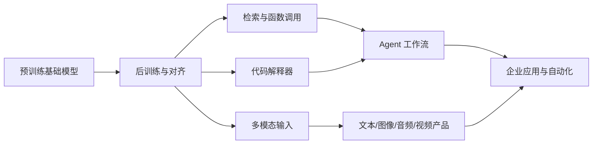
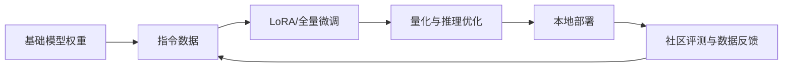

# 2023 技术深度：从大模型到工具化、多模态与开放生态

## 先给出结论

2023 年的技术重点从“训练一个更大的模型”转向“让模型成为可使用的系统”：



2022 年主要回答“模型能不能生成”，2023 年开始回答“模型能不能可靠地完成一项工作”。需要特别说明：2023 年并没有一家企业独自定义出完整的 Agent 通用协议，而是研究论文、模型 API、开源框架和产品实践共同形成了事实上的技术路线。

## 1. GPT-4：能力提升与信息披露边界

### 1.1 从 GPT-3.5 到 GPT-4

GPT-4 仍然是自回归 Transformer 语言模型：给定上下文，逐步预测后续 token。真正的工程进步来自更大规模的预训练、更精细的数据筛选、后训练、监督微调、RLHF 和安全评测组合。

GPT-4 的产品价值主要体现在：

- 更好地遵循多步骤指令；
- 更强的代码生成、代码解释和调试能力；
- 在专业考试和复杂文本任务上表现提升；
- 对长上下文和复杂格式的处理更加稳定；
- 拒答策略、红队测试和安全后训练更系统。

OpenAI 没有公开 GPT-4 的完整架构、参数量、训练数据组成和训练计算量。这使 GPT-4 成为一个重要的产业转折点：前沿模型的技术评估不再只依赖论文可复现性，也依赖模型卡、系统卡、外部评测和产品行为观察。

### 1.2 “更强”不等于“可靠”

GPT-4 可以在很多任务上显著提升，但仍然可能：

- 编造不存在的论文、链接和 API；
- 在长链条推理中出现中间步骤错误；
- 把不确定答案表达得过于自信；
- 对提示注入、越权指令和社会偏见产生脆弱反应。

因此，2023 年的技术评价开始更加重视校准、拒答质量、鲁棒性、隐私和滥用测试，而不是只报告单一考试分数。

## 2. 多模态：从“文本模型接图片”到统一接口

### 2.1 两种多模态路线

2023 年出现了两种主要路线：

| 路线 | 做法 | 代表系统 | 优点与限制 |
|---|---|---|---|
| 连接器路线 | 冻结语言模型，增加视觉编码器、投影层或 cross-attention | GPT-4V、LLaVA 等 | 更容易复用成熟 LLM；视觉能力受连接器和数据限制 |
| 原生多模态路线 | 在训练阶段让模型共同处理文本、图像、音频或视频 | Gemini 1.0 | 模态间对齐更统一；训练数据、算力和评测复杂度更高 |

无论哪条路线，关键问题都是把不同模态转换成模型可处理的 token 或连续表示，并让它们在同一上下文中交互。

### 2.2 PaLM 2 与 Gemini

PaLM 2 延续语言模型规模化路线，强调多语言、推理和代码能力，并被嵌入 Google 的产品与开发者服务。

Gemini 1.0 则进一步把文本、图像、音频和视频理解放进一个模型家族，并按 Ultra、Pro、Nano 划分能力和部署成本。Ultra 面向复杂任务，Pro 面向通用服务，Nano 面向设备端。这种分层成为后续模型产品设计的常见方式。

### 2.3 DALL·E 3：让对话模型参与绘图

早期文本到图像模型经常无法准确理解长 prompt、文字布局和复杂关系。DALL·E 3 的产品路线是让语言模型先帮助改写和结构化用户意图，再把更明确的描述交给图像生成模型。

这代表了一个重要变化：生成图像的控制能力不再只依赖用户学习 prompt 工程，而是通过“语言模型理解需求 + 图像模型渲染结果”的模型组合实现。

## 3. 工具调用：模型从回答者变成调度器

### 3.1 插件、函数调用和 Assistants API

2023 年的工具化逐步形成三层结构：

1. **插件**：模型选择调用浏览、计算或第三方服务。
2. **函数调用**：开发者用 JSON Schema 描述函数，模型输出结构化参数，应用负责真正执行。
3. **Assistants API**：把线程状态、检索、代码解释器和函数调用组合成开发者可以复用的助手框架。

函数调用的关键不是让模型直接执行任意代码，而是把自然语言转换成受约束的结构化动作：

```text
用户请求 → 模型判断是否需要工具 → 输出函数名和参数
→ 应用验证权限和参数 → 外部系统执行
→ 工具结果返回模型 → 模型生成最终回答
```

这使模型可以访问天气、数据库、企业系统、搜索、计算器和代码环境，但也引入新的安全边界：参数校验、权限控制、提示注入、日志审计和失败恢复都必须由应用负责。

### 3.2 工具调用的技术谱系：从 ReAct 到 Function Calling

2023 年的工具化不是凭空出现的，至少有四条互相衔接的路线：

| 时间 | 来源 | 核心贡献 |
|---|---|---|
| 2022 | ReAct（Google Research / Princeton） | 将推理、行动和环境观察交替组织成循环 |
| 2023 | Toolformer（Meta AI 等） | 研究模型如何决定调用哪个 API、传什么参数并吸收结果 |
| 2023 | OpenAI Function Calling | 用 JSON Schema 描述函数，让模型输出结构化调用请求 |
| 2023 | AutoGPT、LangChain 等 | 把规划、记忆、工具和循环包装成开发者可运行的 Agent 框架 |

因此，“模型选择工具—应用执行—结果回传—模型继续判断”是一种架构模式，而不是某家公司拥有的专利协议。OpenAI 在 2023 年把它做成了最早广泛使用的标准化 API 形式，但循环、权限和执行器仍由应用开发者负责。

### 3.3 RAG：给模型接入外部知识

检索增强生成（RAG）通常包括：

1. 把文档切成片段并生成 embedding；
2. 根据用户问题检索相关片段；
3. 把片段和问题一起放入模型上下文；
4. 要求模型依据检索结果回答并给出引用。

RAG 解决的是“模型参数不是实时数据库”的问题，但它不能自动解决检索错误、文档过期、上下文冲突和生成幻觉。更准确地说，RAG 通过外部检索为模型增加一块可更新的“非参数记忆”，因此也适用于企业私有知识、来源引用和领域问答。

RAG 这个名称和经典架构并非 2023 年才出现。2020 年，Facebook AI Research 与伦敦大学学院研究者发表 RAG 论文，将检索器与生成模型结合；2023 年的变化，是 RAG 从研究方法逐步变成企业 AI 应用的基础工程。

### 3.4 Agent 的最小闭环

2023 年被大量讨论的 Agent，不应简单理解成“会自己思考的模型”。一个可工作的 Agent 至少包含：

- 任务拆解或规划；
- 短期上下文和长期记忆；
- 工具选择与参数生成；
- 工具执行和返回结果；
- 结果检查、重试和停止条件；
- 权限、预算、超时和审计。

模型只是其中的决策组件。没有边界的自动循环容易造成错误累积、无限调用和越权操作。

2023 年已经出现 Agent 的早期形态，但当时更多是实验项目和开发者框架；2025—2026 年才逐渐进入更大规模的产品化阶段。因此，不能把 Agent 写成 2026 年才被“发明”，更准确的说法是：思想和原型在 2022—2023 年出现，可靠的商业化和长任务执行在后续年份加速。

还要与 MCP 区分：Anthropic 在 2024 年 11 月发布 Model Context Protocol，用于统一 AI 应用与工具、数据源之间的连接。MCP 是后来的互操作标准，不是 2023 年 Function Calling 的原名。

## 4. 开源模型：从研究复现到本地应用

### 4.1 LLaMA 让“更小但更强”成为现实

Meta 发布 LLaMA 时强调，较小模型可以在合理数据和训练方法下取得很强效果，从而降低研究者的计算门槛。Llama 2 随后提供 7B、13B 和 70B 级别的预训练及对话模型（不同版本可用性和许可需分别核对）。

开源模型生态的技术循环大致是：



### 4.2 LoRA、QLoRA 与低成本微调

全量微调需要更新模型的全部参数，显存和存储开销很高。LoRA 的思路是冻结基础模型，只在部分线性层旁边训练低秩矩阵：

`W' = W + ΔW`，其中 `ΔW = B A`，且 `A、B` 的秩远小于原矩阵。

这样可以用少量可训练参数适配客服、法律、医疗、代码等领域。QLoRA 进一步把基础模型量化到低比特表示，并在量化模型上训练 LoRA 适配器，降低单机微调门槛。

### 4.3 开放不等于完全透明

开源模型提升了可访问性，但需要区分：

- 权重是否公开；
- 训练代码是否公开；
- 数据来源和许可证是否公开；
- 是否允许商业使用；
- 是否公开安全评测与限制；
- 运行模型所需的硬件是否现实可得。

2023 年的争论因此从“开源还是闭源”逐渐转向“开放哪些层、由谁承担风险、如何持续治理”。

## 5. 图像模型：从生成质量转向可控编辑

### 5.1 ControlNet 与结构条件

Stable Diffusion 的纯文本控制很强，但难以精确控制姿态、边缘、深度和构图。ControlNet 通过增加结构条件分支，使用户可以用姿态骨架、边缘图、深度图或草图约束扩散模型。

这让图像生成从“随机创作”走向“可编辑工作流”：保留人物姿势、替换服装、匹配构图、控制镜头和批量生成变得更加可行。

### 5.2 SDXL 与更大分辨率

SDXL 1.0 代表开源扩散模型继续向更高质量、更复杂构图和更稳定的文字理解发展。其价值不只是单次生成质量，还在于它能被接入 ControlNet、LoRA、Inpainting、姿态控制和节点式工作流。

### 5.3 SAM：视觉基础模型的“提示式接口”

SAM 把图像分割设计成一个可提示任务：用户给点、框或 mask，模型返回对应的对象区域。它配套的 SA-1B 数据集包含约 1100 万张图像和超过 10 亿个 mask。

SAM 的意义与语言模型类似：与其为每个行业重新训练一个分割器，不如先训练一个通用基础模型，再通过 prompt 适配新任务。它也暴露了基础视觉模型的限制——跨领域、医学影像和细粒度目标仍需要专门验证。

## 6. 长上下文与推理效率

### 6.1 上下文窗口成为产品指标

2023 年，模型竞争从参数量扩展到上下文长度。更长上下文可以放入整本手册、代码库片段、会议记录或多轮工作状态，但也会带来：

- 注意力计算和显存成本增长；
- 上下文中间信息容易被忽略；
- 检索到的无关内容会污染回答；
- 长文本不等于长期记忆。

GPT-4 Turbo 的 128K 上下文是当时的重要产品信号，但实际效果还取决于模型是否能在长上下文中准确定位和使用信息。

### 6.2 推理优化

为降低服务成本，2023 年的系统工程集中在：

- KV cache：复用已经计算过的注意力键值；
- PagedAttention：更高效地管理不同请求的 KV cache；
- FlashAttention：减少 GPU 内存读写并优化注意力计算；
- 量化：用 8-bit、4-bit 等低精度表示降低显存；
- 批处理和连续批处理：把多个用户请求合并执行；
- 蒸馏和小模型：用更小模型承担低难度任务。

这意味着 AI 产品的成本不只由“模型有多聪明”决定，也由每个 token 的延迟、显存、并发和能源消耗决定。

## 7. 代码与推理：从生成文本到验证过程

2023 年代码模型和代码工具明显进步：Code Llama 等模型专门处理代码；ChatGPT 的代码解释器可以在沙箱中编写并执行 Python；函数调用把模型输出连接到真实 API。

技术重点从“生成一段代码”转向“生成—运行—检查—修复”的循环：

```text
需求 → 生成代码 → 编译/运行 → 读取错误或测试结果
→ 修改代码 → 重复直到通过或达到预算上限
```

这条路线比单次生成可靠，但需要隔离执行环境、测试数据、权限和停止条件。它也解释了为什么 2023 年的代码 Agent 仍不能自动承担所有生产任务。

## 8. 评测与治理：模型之外的系统质量

2023 年开始，模型评测越来越像一组系统测试：

| 维度 | 需要观察的问题 |
|---|---|
| 能力 | 知识、推理、代码、数学、多语言和多模态表现 |
| 可靠性 | 幻觉、校准、引用、长上下文检索准确率 |
| 安全 | 越狱、提示注入、隐私泄露、危险能力和滥用 |
| 公平 | 不同语言、地域、群体和文化语境下的差异 |
| 工程 | 延迟、吞吐、成本、可用性和故障恢复 |
| 治理 | 数据许可、模型卡、红队记录、责任和审计 |

美国行政命令、中国生成式 AI 暂行办法以及欧洲 AI 法案谈判，都说明模型安全已经从公司的自愿声明进入公共治理和合规流程。

## 9. 2023 年技术遗产

- 模型从“聊天界面”变成 API、插件、函数、检索和代码执行平台。
- 多模态输入成为基础模型的主要竞争方向。
- 开源模型把微调、量化和本地部署带入大众开发者生态。
- 图像生成从随机输出走向结构控制、局部编辑和工作流组合。
- Agent 的核心问题从提示词技巧转向状态、工具、权限、验证和可靠性。
- 2023 年形成了“研究思想 + API 约定 + 应用循环”的工具调用路线，但尚无统一行业协议；MCP 的标准化发生在 2024 年。
- 模型评测从单一 benchmark 转向能力、安全、工程和治理的综合评价。

## 参考论文与资料

- [GPT-4 Technical Report](https://arxiv.org/abs/2303.08774)
- [Meta：LLaMA](https://ai.meta.com/blog/large-language-model-llama-meta-ai/)
- [Meta：Llama 2](https://ai.meta.com/research/publications/llama-2-open-foundation-and-fine-tuned-chat-models/)
- [QLoRA](https://arxiv.org/abs/2305.14314)
- [Segment Anything](https://arxiv.org/abs/2304.02643)
- [SDXL](https://arxiv.org/abs/2307.01952)
- [Mamba](https://arxiv.org/abs/2312.00752)
- [RAG：Retrieval-Augmented Generation](https://ai.meta.com/research/publications/retrieval-augmented-generation-for-knowledge-intensive-nlp-tasks/)
- [ReAct：Synergizing Reasoning and Acting](https://arxiv.org/abs/2210.03629)
- [Toolformer：Language Models Can Teach Themselves to Use Tools](https://arxiv.org/abs/2302.04761)
- [OpenAI：Function calling](https://openai.com/index/function-calling-and-other-api-updates/)
- [OpenAI：DevDay 产品发布](https://openai.com/index/new-models-and-developer-products-announced-at-devday/)
- [Anthropic：Model Context Protocol（2024）](https://www.anthropic.com/news/model-context-protocol)
- [Google：Gemini 1.0](https://blog.google/innovation-and-ai/technology/ai/google-gemini-ai/)
