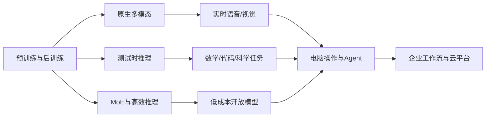

# 2024 技术深度：多模态、长上下文、推理与 Agent 系统化

## 先给出结论

2024 年的技术突破不是单一模型参数再次膨胀，而是模型开始同时具备更多“感官”、更长的工作记忆、更强的推理时计算和更真实的工具操作能力：



2023 年的问题是“模型能否调用工具”，2024 年的问题变成“模型能否在长上下文中理解任务、调用多个工具、检查结果并完成工作”。

## 1. 原生多模态：从输入图片到实时交互

### 1.1 GPT-4o 的 omni 路线

GPT-4o 于 2024 年 5 月发布，输入和输出可以组合文本、图像和音频。它的产品重点不只是多模态 benchmark，而是实时语音对话：模型能够同时处理语音内容、说话节奏、图像和文本上下文。

这要求系统同时优化：

- 音频编码与语音识别；
- 文本和视觉 token 的统一表示；
- 低延迟流式推理；
- 语音合成和打断处理；
- 安全过滤、身份边界和实时内容审核。

实时多模态的难点不是把三个模型简单串起来，而是让模型在同一会话状态中保持语义、时间和情绪的一致性。

### 1.2 Gemini 1.5 与 MoE

Gemini 1.5 于 2024 年 2 月发布，采用 Mixture-of-Experts（MoE）架构，并在预览中展示百万级上下文。MoE 将模型划分为多个专家，每个 token 只激活部分专家，从而在保持较大总容量的同时控制每次计算量。

MoE 的工程难点包括专家负载均衡、跨 GPU 通信、路由稳定性、专家塌缩和服务调度。它不是“参数越多越好”，而是把总参数容量和每 token 计算量拆开管理。

## 2. 长上下文：从窗口大小到有效记忆

### 2.1 百万 token 不等于百万 token 都有用

长上下文使模型可以处理长视频转录、整本书、代码库和企业档案，但实际效果受到“lost in the middle”、检索噪声、位置编码外推和注意力稀释影响。

一个可用的长上下文系统通常需要：

1. 文档解析、去重和结构化；
2. 分块、摘要和层级索引；
3. 相关片段检索与重排序；
4. 上下文缓存和增量更新；
5. 引用、证据链和答案校验。

因此，2024 年 RAG 没有被长上下文取代，而是从“检索片段”发展为“长上下文 + 检索 + 缓存”的混合架构。

### 2.2 长上下文的成本

上下文越长，KV cache 占用、首 token 延迟、带宽和显存压力越大。系统开始使用分页 KV cache、上下文缓存、稀疏注意力、量化和专门的长序列架构，试图让“能读很长”同时变成“读得起”。

## 3. 推理模型：把计算预算放到回答时

### 3.1 o1 与测试时计算

2024 年 9 月，OpenAI 发布 o1-preview，明确把“回答前花更多时间思考”作为模型路线。与传统模型一次生成答案不同，推理模型可以在回答过程中生成中间推理、尝试不同策略、检查错误，再输出最终结果。

这带来一个新的 scaling 维度：

| 传统扩展 | 推理模型扩展 |
|---|---|
| 增大参数和训练数据 | 增加回答时计算预算 |
| 依赖一次前向生成 | 允许搜索、反思、验证和重试 |
| 主要看预训练与后训练 | 同时看 test-time compute 与任务环境 |

推理模型并非在所有任务上都更好。简单问答中额外思考会增加延迟和成本；没有工具、验证器或可靠停止条件时，长推理也可能只是更长的错误。

### 3.2 数学、代码和科学任务

推理模型首先在数学、竞赛编程、逻辑和科学问答中显示优势，因为这些任务有较清晰的验证标准。代码可以编译和测试，数学可以检查答案，科学任务可以与数据库、模拟器或实验约束结合。

这也推动了“生成—执行—验证—修复”的训练和产品循环，而不是只优化文本的流畅度。

## 4. 视频生成：从画面合成到世界模拟

### 4.1 Sora 的 patch 表示

Sora 将视频和图像压缩到潜空间，再切分为时空 patch，使用类似 Transformer 的序列建模方式学习视觉数据。它的技术意义在于：视频不再只是连续帧的拼接，而是可以被当作一种大规模时空 token 序列进行统一训练。

### 4.2 真实感与物理一致性

视频模型在 2024 年明显提高了分辨率、时长、镜头运动和人物一致性，但仍经常出现物理规律错误、物体穿插、手部变形和长时间动作崩坏。生成视频的下一步不只是更清晰，而是更好地理解三维空间、因果关系和可控动作。

视频模型因此被寄予“世界模拟器”期待，但这是一种研究方向，不等于模型已经拥有可靠的物理世界模型。

## 5. 开放模型：MoE、稀疏激活与低成本竞争

### 5.1 Llama 3.1、Qwen2 与 DeepSeek-V2

2024 年开放模型竞争出现三种典型策略：

- **Llama 3.1**：用 405B 模型把开放权重推向前沿规模，并提供 128K 上下文和工具调用；
- **Qwen2**：覆盖 0.5B—72B，多语言、代码、数学和端侧部署同时推进；
- **DeepSeek-V2**：236B 总参数但每 token 约 21B 激活，结合 DeepSeekMoE 和 MLA 降低训练与推理成本。

### 5.2 MLA 与 KV cache

Multi-head Latent Attention（MLA）通过对键值表示进行低秩联合压缩，减少推理时需要保存的 KV cache。对于长上下文和高并发服务，KV cache 往往是显存和成本的主要瓶颈，因此这类结构优化具有直接的商业价值。

### 5.3 开放模型的新定义

“开放”在 2024 年需要拆成多个维度：权重开放、代码开放、数据开放、许可证开放、训练细节开放和安全评测开放。一个模型可以开放权重，却不公开训练数据；也可以允许研究使用，却限制大规模商业服务。

## 6. Agent 与 Computer Use

### 6.1 从函数调用到电脑操作

2023 年的 Agent 主要调用 API；2024 年 Anthropic 的 computer use beta 让模型开始通过截图、鼠标和键盘操作电脑。模型不再只输出函数名，而是观察界面状态、选择坐标、执行动作，再根据新画面继续行动。

### 6.2 Computer Use 的闭环

```text
目标
 ↓
读取屏幕和环境状态
 ↓
规划下一动作
 ↓
鼠标/键盘/终端执行
 ↓
观察结果
 ↓
验证、修正或请求人工确认
```

这个闭环带来新的攻击面：提示注入网页、恶意下载、错误点击、账户权限和不可逆操作。因此，浏览器沙箱、域名白名单、人工确认、操作回放和最小权限成为 Agent 的必要组件。

### 6.3 MCP 的出现

2024 年 11 月，Anthropic 发布 Model Context Protocol，试图用开放标准连接 AI 应用、工具和数据源。MCP 解决的是“如何连接”的互操作问题，不等于模型已经解决了“何时调用、如何规划、如何负责”的 Agent 智能问题。

## 7. 企业 RAG 与云平台

Amazon Bedrock、Azure AI、Vertex AI、阿里云百炼和百度千帆等平台，在 2024 年把模型选择、向量数据库、知识库、微调、评测、权限、日志和 Agent 编排放到一起。

企业 AI 的技术重点因此从“接入一个模型”变成“管理一个模型系统”：

| 系统层 | 关键问题 |
|---|---|
| 数据层 | 来源、权限、脱敏、更新和版权 |
| 检索层 | embedding、召回、重排和引用 |
| 模型层 | 选择、路由、微调、版本和成本 |
| 工具层 | API、函数、浏览器、代码环境 |
| 评测层 | 事实性、任务成功率、安全和回归 |
| 治理层 | 审计、责任、合规和人工介入 |

## 8. AI for Science 与专业模型

AlphaFold 3 等系统显示，大模型方法开始进入分子结构、生物相互作用、材料和科学计算领域。专业 AI 的评价标准不同于聊天机器人：预测是否可实验验证、数据是否可追溯、错误是否能被发现，比语言流畅度更重要。

## 9. 2024 年技术遗产

- 多模态从“图像输入”变成实时语音、视觉和屏幕交互。
- 长上下文、检索和缓存共同构成新的记忆系统。
- 推理时计算成为继参数规模、数据规模之后的新扩展维度。
- 开放模型通过 MoE、MLA、量化和端侧部署降低 AI 成本。
- Agent 从 API 调用扩展到浏览器、代码环境和电脑操作。
- MCP 把工具连接推向开放标准，但没有替代 Agent 的规划与责任机制。
- AI 监管、版权、安全和数据治理正式进入产品生命周期。

## 参考论文与资料

- [OpenAI：GPT-4o](https://openai.com/index/hello-gpt-4o/)
- [OpenAI：Sora 技术报告](https://openai.com/index/video-generation-models-as-world-simulators/)
- [Google：Gemini 1.5](https://blog.google/innovation-and-ai/products/google-gemini-next-generation-model-february-2024/)
- [OpenAI：o1-preview](https://openai.com/index/introducing-openai-o1-preview/)
- [Anthropic：Computer Use](https://www.anthropic.com/news/3-5-models-and-computer-use)
- [Anthropic：MCP](https://www.anthropic.com/news/model-context-protocol)
- [Meta：Llama 3.1](https://ai.meta.com/blog/meta-llama-3-1/)
- [阿里云：Qwen2](https://www.alibabacloud.com/blog/601268)
- [DeepSeek-V2 技术报告](https://arxiv.org/abs/2405.04434)
- [Google DeepMind：AlphaFold 3](https://deepmind.google/science/alphafold/)
- [欧盟 AI Act](https://digital-strategy.ec.europa.eu/en/policies/regulatory-framework-ai)

<!-- fact-matrix: F2024-001,F2024-003,F2024-004,F2024-006,F2024-007,F2024-008,F2024-009,F2024-010 -->
