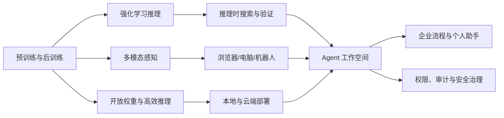

# 2025 技术深度：推理时计算、Agent 系统与开放权重再竞争

## 先给出结论

2025 年的技术主线，是把大模型从“生成答案的模型”改造成“在环境中完成任务的系统”。模型训练仍然重要，但决定真实效果的因素扩展为：推理时计算、工具调用、浏览器/终端交互、长程记忆、结果验证、权限和成本。



## 1. 推理时计算：新的 Scaling 维度

### 1.1 从“训练更大”到“回答时想更久”

2024 年的 o1 先展示了推理时计算的产品价值，2025 年 DeepSeek-R1、Claude 3.7、Gemini 2.5、o3/o4-mini、Claude Sonnet 4.5、Gemini 3 和 GPT-5 把这条路线扩展成完整模型家族。系统可以在回答前生成中间步骤、尝试不同策略、调用工具、检查结果，再决定输出。

传统模型的成本主要来自一次前向生成；推理模型的成本还包括思考 token、搜索分支、验证器和失败重试。因此，模型服务开始暴露或内部管理“思考预算”“推理强度”“最大步骤数”和“何时停止”。

### 1.2 强化学习与可验证任务

DeepSeek-R1 的技术叙事强调大规模强化学习和冷启动数据。数学、代码和逻辑任务具有较强的可验证性：答案可以由程序执行、单元测试、数学判题器或形式规则检查。训练目标于是从“人类偏好”扩展到“任务结果是否正确”。

这并不意味着所有推理都可靠。开放式研究、社会判断和现实世界行动缺乏单一验证器，模型可能把更长的推理变成更长的错误。因此，推理模型必须与检索、工具、引用和人工复核组合。

### 1.3 混合推理

Claude 3.7 和 Qwen3 都把快速回答与深度思考放进同一个产品选择中。混合推理的目标不是让每个问题都慢，而是根据任务复杂度分配计算：简单问题节省延迟，复杂问题增加搜索和检查。

## 2. Agent：从函数调用到可恢复任务

### 2.1 Agent 的系统结构

2025 年的 Agent 不应理解为“一个更聪明的提示词”，而是一个有状态的软件系统：

| 层 | 作用 | 典型问题 |
|---|---|---|
| 目标层 | 把用户意图转为可执行任务 | 目标是否明确、是否需要确认 |
| 规划层 | 分解步骤、选择工具和路径 | 计划漂移、循环、长程错误 |
| 记忆层 | 保存任务状态、文件和中间结果 | 过期信息、隐私、上下文膨胀 |
| 工具层 | 浏览器、终端、API、数据库、办公软件 | 参数、权限、幂等性、失败重试 |
| 验证层 | 测试、引用、规则和人工确认 | 成功标准是否可计算 |
| 治理层 | 沙箱、审计、成本、回放和停止 | 谁负责不可逆操作 |

Agent 的评价对象因此从单轮准确率变为任务完成率、步骤数、恢复率、人工接管率、总成本和错误严重度。

### 2.2 Operator 与 Computer-Using Agent

OpenAI Operator 在 2025 年 1 月把浏览器操作做成独立产品。模型读取截图，点击按钮、输入文字、滚动页面，并在登录、支付和验证码等高风险节点把控制权交还用户。

这条路线的核心不是“模型看懂网页”这么简单，而是把视觉感知、动作空间、浏览器状态、安全确认和异常恢复放进闭环。网页本身也可能包含提示注入，任何来自页面的文字都不能自动被当作可信指令。

### 2.3 ChatGPT agent 与工作空间

2025 年 7 月，ChatGPT agent 把 Deep Research 的检索总结、Operator 的浏览器、终端和连接器组合起来。Agent 开始输出报告、表格和演示文稿等可交付成果，聊天界面变成任务工作空间。

这代表 Agent 产品的一个重要转变：用户不再只购买“回答”，而是购买“从目标到交付物的过程”。但系统必须明确哪些动作可以自动做，哪些动作必须逐步确认。

## 3. 编码 Agent：最容易验证的真实世界任务

### 3.1 Claude Code、Codex CLI 与 Cursor

2025 年编码 Agent 集中出现。Claude Code、Codex CLI、Cursor、Devin、Qwen3-Coder 等工具都在尝试同一循环：读取代码库、规划修改、编辑多个文件、运行测试、分析错误、继续修复。

软件工程适合作为 Agent 的第一生产力场景，因为它有明确的外部验证器：编译器、测试套件、类型检查、版本控制和代码审查。模型生成的代码不再以“看起来正确”为标准，而要通过可执行验证。

### 3.2 长程编码的瓶颈

- **上下文**：大型仓库无法全部放进上下文，需要索引、检索和摘要；
- **状态**：终端、依赖、分支和测试环境会在长任务中变化；
- **错误传播**：一次错误的架构决定可能导致后续几十步返工；
- **权限**：代码 Agent 可能读取密钥、修改生产配置或执行危险命令；
- **成本**：长任务的 token、工具调用和重试成本远高于单轮补全。

因此，编码 Agent 的关键基础设施包括工作区隔离、命令白名单、补丁审查、自动回滚、测试门禁和任务预算。

## 4. 开放权重：从追赶到重新定义部署

### 4.1 DeepSeek-R1、Qwen3、Llama 4 与 gpt-oss

2025 年开放模型出现明显分化：

- **DeepSeek-R1**：以强化学习、推理和蒸馏推动开放推理模型；
- **Qwen3**：以 Dense + MoE、多尺寸、混合思考模式和 MCP 支持覆盖云端、端侧与 Agent；
- **Llama 4**：把原生多模态、MoE 和 Meta AI 产品生态结合；
- **gpt-oss**：OpenAI 发布 120B 和 20B 开放权重推理模型，强调本地部署、低成本和工具调用。

开放模型的竞争单位由“是否公开权重”扩展为：是否能在单机或有限 GPU 上运行、是否支持量化、是否便于微调、是否有稳定许可证、是否能进入 Agent 工具链。

### 4.2 开放权重不等于开放科学

仍需区分：

1. 权重是否公开；
2. 推理代码和训练代码是否公开；
3. 训练数据和数据处理流程是否公开；
4. 许可证是否允许商业使用和再分发；
5. 安全评测、系统卡和风险缓解是否公开。

2025 年“open-weight”成为更准确的表述：用户可以下载和运行权重，但未必获得完整的训练数据、过滤过程和治理能力。

## 5. 多模态生成：视频开始带声音，创作开始有时间线

### 5.1 Veo 3 与 Flow

Google 在 2025 年 5 月发布 Veo 3 和 Flow。Veo 3 把对白、环境声和音效纳入视频生成，Flow 则将 Veo、Imagen 与 Gemini 组合为面向创作者的工作流。

这意味着视频模型的输出单位从“一个无声片段”转向“可剪辑的场景”：角色、镜头、动作、声音和故事上下文需要在多轮生成中保持一致。

### 5.2 新的真实性问题

视频越真实，验证来源越重要。水印、内容凭证、生成记录、肖像授权和声音同意成为技术系统的一部分。生成模型的工程目标因此同时包含画质、可控性、连续性和可追溯性。

## 6. MCP 与工具互操作

2024 年提出的 Model Context Protocol 在 2025 年得到更广泛采用。MCP 的价值是把工具、资源和提示模板的连接方式标准化，减少每个 Agent 都要单独编写连接器的成本。

但 MCP 只解决“连接协议”，不解决：

- 模型是否会正确选择工具；
- 工具参数是否安全；
- 返回内容是否可信；
- 任务是否需要人工确认；
- 多 Agent 之间如何共享责任。

在生产环境中，MCP 服务器仍需身份认证、最小权限、输入验证、审计、速率限制和输出过滤。

## 7. 高效推理与基础设施

### 7.1 MoE、量化与本地运行

MoE 让模型拥有较大的总容量，同时只激活少量专家；量化降低权重和 KV cache 的存储；蒸馏把大模型的推理能力迁移到更小模型。2025 年这些技术不再只是论文优化，而是直接决定 Agent 能否在企业私有环境或个人设备运行。

### 7.2 Agent 的成本模型

单次 token 价格已经不能代表真实成本。一个 Agent 任务的成本可以粗略表示为：

```text
总成本 = 输入/输出 token
       + 思考 token
       + 工具调用与检索
       + 浏览器/代码执行
       + 失败重试
       + 人工审核与接管
```

如果模型用更少 token 但频繁失败，任务总成本反而更高。企业评测应以“每个成功交付物的成本”而不是“每百万 token 的价格”为主。

## 8. AI for Science、机器人与现实环境

2025 年，Gemini 2.5、Gemini 3、AlphaEvolve、机器人模型和视觉—语言—动作研究继续推动 AI 进入科学计算、代码搜索、实验设计和实体环境。现实环境比网页更难：传感器有噪声，动作不可逆，反馈延迟更长，安全边界也更严格。

因此，具身智能和科学 Agent 需要模拟器、工具验证、实验记录、可重复性和人类监督，不能把语言模型的流畅性直接等同于物理世界能力。

## 9. 监管与模型发布工程

欧盟 AI Act 的 GPAI 义务在 2025 年 8 月 2 日开始适用，模型供应商需要准备技术文档、版权政策和训练内容摘要；达到系统性风险条件的模型还要承担更高的评估和风险管理责任。

这使“发布模型”从一次技术公告变成一套工程流程：数据记录、训练可追溯性、能力评测、红队测试、系统卡、部署限制和事故响应都要在上线前准备。

## 10. 2025 年技术遗产

- 推理时计算成为继参数、数据和算力之后的新扩展维度；
- Agent 从函数调用进入浏览器、终端、文件和办公工作空间；
- 编码 Agent 用编译、测试和版本控制建立外部验证闭环；
- DeepSeek-R1、Qwen3、Llama 4 和 gpt-oss 重新定义开放权重竞争；
- 多模态生成从无声片段扩展到带对白、音效和时间线的创作流程；
- MCP 推动工具连接标准化，但权限和责任仍需由系统设计解决；
- AI Act 让训练数据、版权和系统性风险进入模型发布清单。

## 参考论文与资料

- [DeepSeek-R1 技术资料](https://github.com/deepseek-ai/DeepSeek-R1)
- [OpenAI：Operator](https://openai.com/index/introducing-operator/)
- [Anthropic：Claude 3.7 Sonnet 与 Claude Code](https://www.anthropic.com/news/claude-3-7-sonnet)
- [Google：Gemini 2.5](https://blog.google/products-and-platforms/products/gemini/gemini-2-5-model-family-expands/)
- [OpenAI：o3 与 o4-mini](https://openai.com/index/introducing-o3-and-o4-mini/)
- [阿里巴巴：Qwen3](https://home.alibabagroup.com/en-US/document-1853940226976645120)
- [Meta：Llama 4](https://ai.meta.com/blog/llama-4-multimodal-intelligence/)
- [Anthropic：Claude 4](https://www.anthropic.com/news/claude-4)
- [Anthropic：Claude Sonnet 4.5](https://www.anthropic.com/news/claude-sonnet-4-5)
- [Google：Veo 3 与 Flow](https://blog.google/innovation-and-ai/products/generative-media-models-io-2025/)
- [OpenAI：ChatGPT agent](https://openai.com/index/introducing-chatgpt-agent/)
- [OpenAI：gpt-oss](https://openai.com/index/introducing-gpt-oss/)
- [OpenAI：GPT-5](https://openai.com/index/introducing-gpt-5/)
- [Google：Gemini 3](https://blog.google/products-and-platforms/products/gemini/gemini-3/)
- [欧盟委员会：GPAI 义务](https://digital-strategy.ec.europa.eu/en/factpages/general-purpose-ai-obligations-under-ai-act)
- [Stanford HAI：2025 AI Index](https://hai.stanford.edu/ai-index/2025-ai-index-report)

<!-- fact-matrix: F2025-002,F2025-004,F2025-005,F2025-006,F2025-008,F2025-010,F2025-011,F2025-013,F2025-016,F2025-017,F2025-018,F2025-019,F2025-020,F2025-021,F2025-022,F2025-023 -->
