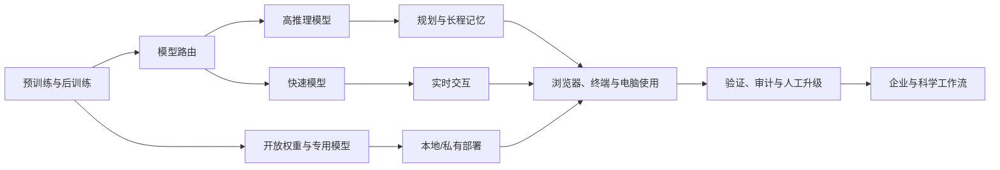

# 2026 技术深度：长程 Agent、模型分层与专业化工作流

> **截止日**：2026-08-15。本文讨论截至该日已经公开的技术和系统趋势，不把下半年计划或未经证实的传闻写成事实。

## 先给出结论

2026 年的技术竞争，已经从“谁的模型回答更好”转为“谁能让模型在真实环境中完成更长、更复杂、可验证的任务”。模型本身仍在进步，但系统效果越来越由以下因素共同决定：

1. 推理预算和模型路由；
2. 电脑使用、浏览器、终端和连接器；
3. 记忆、状态、检查点和失败恢复；
4. 工具权限、沙箱、审计和人工升级；
5. 专业数据、科学工具和领域验证器；
6. 单个成功交付物的总成本与能耗。



## 1. 模型分层：从旗舰型号到运行时路由

### 1.1 多档位成为默认架构

GPT-5.4、GPT-5.5 和 GPT-5.6 Sol/Terra/Luna 展示了“同一代模型、不同持续能力档位”的结构；Gemini 3.5 Flash 与 Gemini Omni、Claude Fable 5 与 Mythos 5、MiniMax M2.5/M3/H3 也呈现类似分层。

分层解决的是产品工程问题：

| 档位 | 目标 | 典型取舍 |
|---|---|---|
| 快速档 | 对话、摘要、实时语音和简单工具 | 低延迟、低成本，但长程规划较弱 |
| 平衡档 | 日常办公、代码修改和搜索 | 能力、速度与价格折中 |
| 高推理档 | 研究、复杂编码、科学与安全 | 计算预算高、等待更久、需更强治理 |
| 专用档 | 生物、图像、视频、语音、音乐 | 领域效果好，但通用性和生态不同 |
| 开放权重档 | 本地、私有云和可定制工作流 | 部署自由度高，但运维和安全责任转移给用户 |

### 1.2 路由器成为产品的一部分

模型选择不再完全交给用户。系统可以根据任务难度、权限、延迟、预算和风险，把请求路由到不同模型。路由器的错误会直接影响成本和质量：把简单问题送到高推理模型会浪费预算，把高风险动作送到快速模型则可能增加错误。

因此，2026 年的模型评测必须记录“模型 + 路由策略 + 工具环境”，不能只公布单一模型分数。

## 2. 推理时计算：从思考 token 到持续行动

### 2.1 推理预算成为运行时变量

GPT-5.4 的 Thinking、GPT-5.6 的 `max` 与 `ultra`，以及其他模型的 effort/思考开关，都把“回答前花多少计算”变成产品旋钮。系统可按任务复杂度决定：

```text
推理预算 = 思考 token
         + 搜索与工具调用
         + 候选方案分支
         + 验证器执行
         + 失败重试
```

推理越久不必然越正确。开放式判断、现实世界搜索和高风险执行没有稳定的自动验证器，长思考可能只是把错误叙述得更完整。

### 2.2 Subagent 与并行化

GPT-5.6 的 ultra 模式把 subagent 纳入复杂任务。并行 Agent 可以分别检索、编码、审查和验证，再由主 Agent 汇总。它提高吞吐，却引入新的协调问题：

- 多个 Agent 是否共享同一事实和权限；
- 一个 Agent 的错误是否会被其他 Agent 放大；
- 并行调用是否造成重复成本；
- 谁负责最终交付物；
- 是否保留每个子任务的证据链。

因此，subagent 不是“免费增加智力”，而是把模型问题转化为分布式系统问题。

## 3. 长程 Agent：任务状态比上下文长度更重要

### 3.1 Agent 的状态机

长程 Agent 至少需要以下状态：

```text
目标 → 计划 → 执行 → 观察 → 验证
         ↑      ↓       ↓
       修订 ← 失败 ← 人工接管
```

上下文窗口只解决“当前能看到多少信息”，不解决“系统是否知道自己已经完成了什么”。生产 Agent 需要任务数据库、文件状态、工具返回值、检查点、预算和人工决策记录。

### 3.2 电脑使用与软件环境

GPT-5.4 把原生电脑使用纳入主线，OpenAI Presence 则把 Agent 放进客服、保险和 IT 服务等企业流程。电脑使用系统的技术难点包括：

- 屏幕像素不是结构化 DOM，感知存在误差；
- 软件界面会变化，动作需要重定位；
- 登录、支付、验证码和发送消息具有不可逆风险；
- 页面和文档可能包含提示注入；
- 操作失败后要能回退，而不是盲目重试。

合格的电脑使用 Agent 应拥有只读模式、操作预览、敏感动作确认、域名和应用白名单、回放日志与人工接管。

### 3.3 工具搜索与连接器

工具数量增加后，模型不能把所有工具定义都塞入上下文。GPT-5.4 引入 tool search 的思路，先检索可能相关的工具，再决定调用。未来工具协议的关键不只在互操作，也在：工具描述是否可信、权限是否最小化、返回结果是否可验证、工具是否幂等。

## 4. 编码 Agent：从补全到软件生命周期

### 4.1 为什么编码最先落地

代码有编译器、测试、类型系统、版本控制和部署门禁，适合形成“生成—执行—验证—修复”的闭环。Claude Code、Codex、Cursor、Devin、Qwen 系列和 MiniMax M 系列都把代码库理解、终端操作和长程修改作为核心场景。

### 4.2 评测正在改变

SWE-bench Verified 从约 60% 上升到接近 100%，说明公开代码修复基准的上限正在被触及，但不代表真实软件工程已经解决。更有意义的指标包括：

| 指标 | 说明 |
|---|---|
| 首次通过率 | 第一次提交是否通过测试 |
| 长程完成率 | 跨多个文件、依赖和工具的任务成功率 |
| 修复恢复率 | 出错后能否定位并回到正确路径 |
| 人工接管率 | 需要人类介入的频率和严重程度 |
| 每次交付成本 | token、工具、算力和审查的总和 |
| 安全违规率 | 是否读取密钥、越权或执行危险命令 |

### 4.3 编码 Agent 的安全边界

代码 Agent 必须在工作区隔离、命令白名单、网络限制、密钥脱敏、补丁审查和测试门禁下运行。给模型更高权限可以提高任务完成率，也会扩大错误半径；“全自动”不是技术成熟度的唯一标志。

## 5. 科学与专业 Agent：模型成为研究流程的一环

### 5.1 GPT-Rosalind 的意义

GPT-Rosalind 面向生物学、药物发现、蛋白质工程和基因组学，体现领域模型的三个变化：

1. 模型不只读论文，还要调用数据库、分析实验数据；
2. 输出不只是一段文字，还要形成可复现的假设、代码和实验计划；
3. 评价标准从语言流畅性转向科学结果、引用和实验验证。

### 5.2 科学工作流的验证器

科学 Agent 需要领域工具作为外部验证器：结构预测、分子模拟、统计检验、代码执行、文献引用和实验记录。与聊天机器人相比，科学 Agent 的错误代价更高，因而必须保留数据来源、参数、版本和中间结果。

## 6. 多模态：从“看图”到跨媒体创作与操作

### 6.1 文本、图像、视频、音频成为同一输入空间

Gemini Omni、MiniMax M3/H3、ChatGPT Images 2.0 等产品把文本、图片、视频和音频放在同一工作流。多模态的关键不只是输入格式更多，而是模型需要建立跨媒体的时间、空间和因果一致性。

### 6.2 视频和音乐生成的工程问题

视频模型需要保持角色、镜头、动作、光照和声音连续；音乐模型需要处理结构、风格、节拍、乐器和版权。生成质量之外，水印、内容凭证、训练授权和声音肖像同意成为系统设计的一部分。

## 7. 开放权重：可部署性成为前沿指标

DeepSeek-V4、Qwen3.5、MiniMax M3/H3 说明开放模型继续向前沿推进。开放权重的技术价值主要体现在：

- 私有数据不必离开企业环境；
- 可针对领域微调、量化和蒸馏；
- 可在不同硬件上进行成本优化；
- 可审计推理流程和部署依赖；
- 可形成开发者和下游模型生态。

但开放权重不等于完整开放科学。仍应分别记录权重、代码、数据、许可证、安全评测和商业使用限制。

## 8. Agent 平台：企业需要的是治理层

OpenAI Frontier、Presence 与 Anthropic Labs 所代表的平台化路线，都把模型之外的能力放到产品中心：

| 治理组件 | 解决的问题 |
|---|---|
| 身份与权限 | Agent 能看什么、改什么、代表谁行动 |
| 沙箱与网络策略 | 限制代码、浏览器和外部系统的影响范围 |
| 任务预算 | 控制 token、工具、时间和并发 |
| 评测与回放 | 确认版本更新是否真的提高质量 |
| 人工升级 | 在高风险或不确定时交还控制权 |
| 审计与事故响应 | 解释发生了什么并修复系统 |

Agent 的可靠性不是一次 benchmark 分数，而是上线后的持续运维能力。

## 9. 基础设施：算力、能耗与单位交付成本

Stanford 2026 AI Index 报告称，AI 数据中心功率容量达到 29.6 GW；研究还估计，GPT-4o 年度推理用水量可能超过 120 万人的饮用水需求。模型效率、量化、缓存、批处理、蒸馏和路由，不只是节约成本，也是能源和供应链约束下的必要技术。

Agent 的成本更适合用“每个成功交付物”衡量：

```text
交付成本 = 模型 token
         + 推理/思考 token
         + 检索与工具调用
         + 浏览器/代码执行
         + 失败重试
         + 人工审查与接管
         + 基础设施与能耗分摊
```

## 10. 透明度、评测与安全

AI Index 2026 报告指出，行业在能力 benchmark 上的披露远多于责任 benchmark，记录到的 AI 事故从 2024 年的 233 起上升到 362 起。模型越能行动，安全评估就越要覆盖：

- 长程任务中的越权与目标漂移；
- 浏览器提示注入和工具投毒；
- 代码 Agent 的密钥、供应链和网络风险；
- 生物、化学和网络安全能力的双重用途；
- 多 Agent 协作中的责任归属；
- 版本更新后行为变化和回滚能力。

## 11. 2026 年技术遗产（截至 8 月 15 日）

- 模型家族开始按能力、速度、成本和责任分层；
- 长程 Agent 的核心从“会规划”转为“有状态、可恢复、可审计”；
- 电脑使用成为主流模型的基础能力之一；
- 编码 Agent 进入软件生命周期，但真实工程仍需要测试和审查；
- 科学 Agent 开始连接领域数据库、模拟器和实验流程；
- 开放权重竞争扩展到多模态、视频和超长上下文；
- 数据中心、电力、用水、透明度和事故响应成为模型能力的硬约束。

## 参考资料

- [OpenAI：GPT-5.4](https://openai.com/index/introducing-gpt-5-4/)
- [OpenAI：GPT-5.5](https://openai.com/index/introducing-gpt-5-5/)
- [OpenAI：GPT-5.6 Sol](https://openai.com/index/previewing-gpt-5-6-sol/)
- [OpenAI：GPT-Rosalind](https://openai.com/index/introducing-gpt-rosalind/)
- [OpenAI：Presence](https://openai.com/index/introducing-openai-presence/)
- [Anthropic：Anthropic Labs](https://www.anthropic.com/news/introducing-anthropic-labs)
- [Anthropic：Claude Fable 5 与 Mythos 5](https://www.anthropic.com/news/claude-fable-5-mythos-5)
- [Google：Gemini 应用升级](https://blog.google/innovation-and-ai/products/gemini-app/next-evolution-gemini-app/)
- [DeepSeek：透明度中心](https://www.deepseek.com/en/transparency/)
- [Qwen：Qwen3.5](https://qwen.ai/blog?email_hash=23463b99b62a72f26ed677cc556c44e8&id=qwen3.5)
- [MiniMax：M3](https://www.minimax.io/blog/minimax-m3)
- [Stanford HAI：2026 AI Index](https://hai.stanford.edu/ai-index/2026-ai-index-report)
- [Stanford HAI：研发与基础设施章节](https://hai.stanford.edu/ai-index/2026-ai-index-report/research-and-development)
