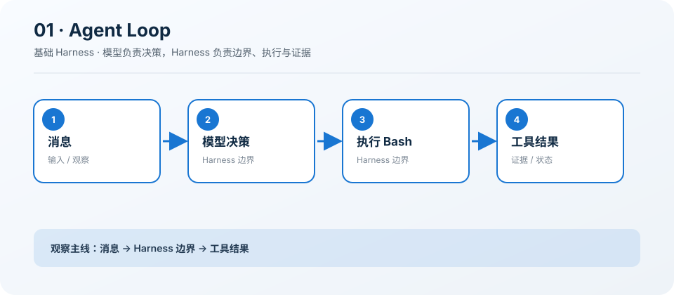

# 01: Agent Loop — 一个循环就够了

起点 · [课程地图](../README.md) · [s02 →](../s02_tool_use/README.md)

> “一个工具 + 一个循环 = 一个 Agent”
>
> Harness 层：循环。本章只增加一个机制，Agent 的核心决策循环保持不变。

## 本章目标

学完后，你应该能解释这个机制解决的具体问题、指出它插入 Agent Loop
的位置，并能修改一个约束后验证行为变化。

## 问题

普通聊天模型只能给建议，无法执行命令、观察结果并继续判断。

## 解决方案

用消息历史连接模型与 Bash：模型请求工具，Harness 执行并回填，直到模型不再调用工具。

## 工作原理

1. 组装 system/user 消息。
2. 调用 Provider 并保存 assistant 消息。
3. 执行 tool_calls 并按 call id 回填结果。
4. 没有工具调用时返回最终文本。

### 执行链

```text
user → model → bash → tool result → model → final
```

模型负责决定下一步，Harness 负责校验、执行、记录和限制。失败也作为观察返回模型，而不是被隐藏。

## 读代码

- 实现：[code.ts](./code.ts)
- 运行：`deno task s01`
- 类型检查：`deno check stages/s01_agent_loop/code.ts`

沿着注册点、输入校验、执行函数和 `agentLoop()`
四处阅读。先找到本章新增的状态或工具，再追踪它如何复用前一章。

## 观察清单

观察一次 Bash 调用为什么至少需要两次模型请求，以及工具错误如何成为下一轮输入。

建议同时记录：模型看见了什么 Schema、Harness
实际执行了什么、结果如何回到消息历史，以及取消或失败发生在哪一层。

## 边界与生产差距

本章故意没有权限、总轮次和总时长限制；它只证明最小闭环，不能直接视作安全运行时。

课程代码为了突出机制会使用简化存储、协议或策略。不要把它直接导入 `src/`；迁移时应围绕生产
Registry、Runtime 和 Feature 契约重新实现。

## 动手练习

1. 修改一个预算、状态或校验条件，预测行为后再运行验证。
2. 构造一个失败输入，确认错误有界、可观察，且不会破坏已完成状态。
3. 写出该机制迁移到生产 `HarnessFeature` 时需要的输入、事件、权限类别和取消路径。

## 过关标准

- 能不看代码画出上面的执行链。
- 能运行本章并解释一次关键事件或工具结果。
- 能说清教学简化与生产边界，而不是只描述“功能能用”。

## 下一章

进入 [s02 →](../s02_tool_use/README.md)，在同一个 Loop 上继续增加下一项能力。

## 课程图



图中把本章新增机制放在统一 Agent Loop
的边界上；阅读代码时，沿箭头核对输入、执行、限制和证据是否一致。
