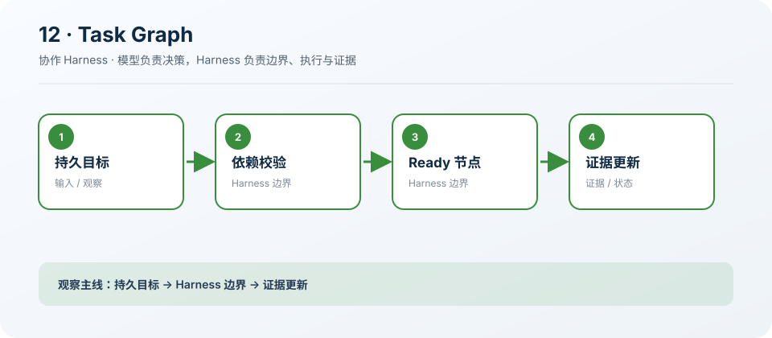

# 12: Task Graph — 让长期目标可恢复

[← s11](../s11_error_recovery/README.md) · [课程地图](../README.md) ·
[s13 →](../s13_background_tasks/README.md)

> “长期任务需要依赖图，不只是清单”
>
> Harness 层：任务状态。本章只增加一个机制，Agent 的核心决策循环保持不变。

## 本章目标

学完后，你应该能解释这个机制解决的具体问题、指出它插入 Agent Loop
的位置，并能修改一个约束后验证行为变化。

## 问题

线性 Todo 无法表达跨会话依赖，也无法让多个执行者判断哪些节点已经可以开始。

## 解决方案

保存带稳定 ID、状态和 dependsOn 的工作图，写入前验证引用、状态和环。

## 工作原理

1. 读取工作区隔离的图快照。
2. 验证节点与依赖完整性。
3. 检测自依赖和环。
4. 推导 ready、blocked 与 completed。

### 执行链

```text
durable goal → dependency graph → claim ready node → evidence → update
```

模型负责决定下一步，Harness 负责校验、执行、记录和限制。失败也作为观察返回模型，而不是被隐藏。

## 读代码

- 实现：[code.ts](./code.ts)
- 运行：`deno task s12`
- 类型检查：`deno check stages/s12_persistent_task_graph/code.ts`

沿着注册点、输入校验、执行函数和 `agentLoop()`
四处阅读。先找到本章新增的状态或工具，再追踪它如何复用前一章。

## 观察清单

建立“分析 → 实现 → 验证”链，重启后确认状态仍在，并故意制造环验证拒绝。

建议同时记录：模型看见了什么 Schema、Harness
实际执行了什么、结果如何回到消息历史，以及取消或失败发生在哪一层。

## 边界与生产差距

生产存储必须原子写入并处理并发 revision/lease；聊天历史不能成为任务状态的唯一来源。

课程代码为了突出机制会使用简化存储、协议或策略。不要把它直接导入 `src/`；迁移时应围绕生产
Registry、Runtime 和 Feature 契约重新实现。

## 动手练习

1. 修改一个预算、状态或校验条件，预测行为后再运行验证。
2. 构造一个失败输入，确认错误有界、可观察，且不会破坏已完成状态。
3. 写出该机制迁移到生产 `HarnessFeature` 时需要的输入、事件、权限类别和取消路径。

## 过关标准

- 能不看代码画出上面的执行链。
- 能运行本章并解释一次关键事件或工具结果。
- 能说清教学简化与生产边界，而不是只描述“功能能用”。

## 下一章

进入 [s13 →](../s13_background_tasks/README.md)，在同一个 Loop 上继续增加下一项能力。

## 课程图



图中把本章新增机制放在统一 Agent Loop
的边界上；阅读代码时，沿箭头核对输入、执行、限制和证据是否一致。
