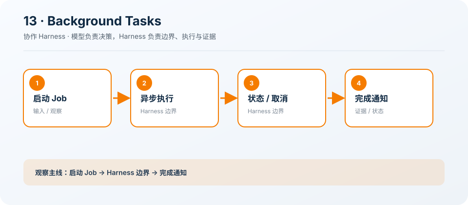

# 13: Background Tasks — 慢操作离开主循环

[← s12](../s12_persistent_task_graph/README.md) · [课程地图](../README.md) ·
[s14 →](../s14_cron_scheduling/README.md)

> “慢命令在后台跑，Agent 继续思考”
>
> Harness 层：后台执行。本章只增加一个机制，Agent 的核心决策循环保持不变。

## 本章目标

学完后，你应该能解释这个机制解决的具体问题、指出它插入 Agent Loop
的位置，并能修改一个约束后验证行为变化。

## 问题

构建、测试和服务器可能运行很久；同步等待会冻结 Agent，也难以及时响应取消。

## 解决方案

background_start 返回任务 ID，status 提供有界观察，cancel 终止仍在运行的进程。

## 工作原理

1. 限制同时运行数量。
2. 绑定任务与工作区。
3. 异步收集 stdout/stderr。
4. 在完成、超时或取消时更新状态。

### 执行链

```text
start → job id → do other work → status/cancel → completion event
```

模型负责决定下一步，Harness 负责校验、执行、记录和限制。失败也作为观察返回模型，而不是被隐藏。

## 读代码

- 实现：[code.ts](./code.ts)
- 运行：`deno task s13`
- 类型检查：`deno check stages/s13_background_tasks/code.ts`

沿着注册点、输入校验、执行函数和 `agentLoop()`
四处阅读。先找到本章新增的状态或工具，再追踪它如何复用前一章。

## 观察清单

启动一个短任务和一个超时任务，比较 completed、timed_out、cancelled 状态。

建议同时记录：模型看见了什么 Schema、Harness
实际执行了什么、结果如何回到消息历史，以及取消或失败发生在哪一层。

## 边界与生产差距

生产要清理整个进程树、增量读取日志、传播父级取消，并在应用退出时终止或显式分离所有子进程。

课程代码为了突出机制会使用简化存储、协议或策略。不要把它直接导入 `src/`；迁移时应围绕生产
Registry、Runtime 和 Feature 契约重新实现。

## 动手练习

1. 修改一个预算、状态或校验条件，预测行为后再运行验证。
2. 构造一个失败输入，确认错误有界、可观察，且不会破坏已完成状态。
3. 写出该机制迁移到生产 `HarnessFeature` 时需要的输入、事件、权限类别和取消路径。

## 过关标准

- 能不看代码画出上面的执行链。
- 能运行本章并解释一次关键事件或工具结果。
- 能说清教学简化与生产边界，而不是只描述“功能能用”。

## 下一章

进入 [s14 →](../s14_cron_scheduling/README.md)，在同一个 Loop 上继续增加下一项能力。

## 课程图



图中把本章新增机制放在统一 Agent Loop
的边界上；阅读代码时，沿箭头核对输入、执行、限制和证据是否一致。
