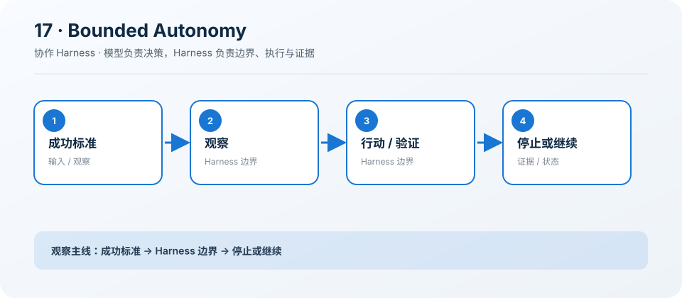

# 17: Autonomous Agent — 自治必须有边界

[← s16](../s16_team_protocol/README.md) · [课程地图](../README.md) ·
[s18 →](../s18_git_worktree/README.md)

> “自治是有界反馈循环，不是无限 while”
>
> Harness 层：自治。本章只增加一个机制，Agent 的核心决策循环保持不变。

## 本章目标

学完后，你应该能解释这个机制解决的具体问题、指出它插入 Agent Loop
的位置，并能修改一个约束后验证行为变化。

## 问题

只让模型“继续直到完成”无法控制时间、成本和停滞，也容易把自我声明误当成真实成功。

## 解决方案

用目标、可测成功标准、迭代和时间上限驱动 observe–act–verify 循环。

## 工作原理

1. 每轮携带目标与历史证据。
2. 在环境中行动并验证。
3. 满足标准时提前停止。
4. 耗尽预算时如实返回未完成。

### 执行链

```text
observe → act → verify → complete / continue / stop
```

模型负责决定下一步，Harness 负责校验、执行、记录和限制。失败也作为观察返回模型，而不是被隐藏。

## 读代码

- 实现：[code.ts](./code.ts)
- 运行：`deno task s17`
- 类型检查：`deno check stages/s17_autonomous_agent/code.ts`

沿着注册点、输入校验、执行函数和 `agentLoop()`
四处阅读。先找到本章新增的状态或工具，再追踪它如何复用前一章。

## 观察清单

设置一个无法满足的标准，确认循环在预算耗尽时停止，而不是伪造完成。

建议同时记录：模型看见了什么 Schema、Harness
实际执行了什么、结果如何回到消息历史，以及取消或失败发生在哪一层。

## 边界与生产差距

字符串完成标记不是证据；生产 Verifier 应独立读取环境，并检测重复动作、共享总预算和完整传播取消。

课程代码为了突出机制会使用简化存储、协议或策略。不要把它直接导入 `src/`；迁移时应围绕生产
Registry、Runtime 和 Feature 契约重新实现。

## 动手练习

1. 修改一个预算、状态或校验条件，预测行为后再运行验证。
2. 构造一个失败输入，确认错误有界、可观察，且不会破坏已完成状态。
3. 写出该机制迁移到生产 `HarnessFeature` 时需要的输入、事件、权限类别和取消路径。

## 过关标准

- 能不看代码画出上面的执行链。
- 能运行本章并解释一次关键事件或工具结果。
- 能说清教学简化与生产边界，而不是只描述“功能能用”。

## 下一章

进入 [s18 →](../s18_git_worktree/README.md)，在同一个 Loop 上继续增加下一项能力。

## 课程图



图中把本章新增机制放在统一 Agent Loop
的边界上；阅读代码时，沿箭头核对输入、执行、限制和证据是否一致。
