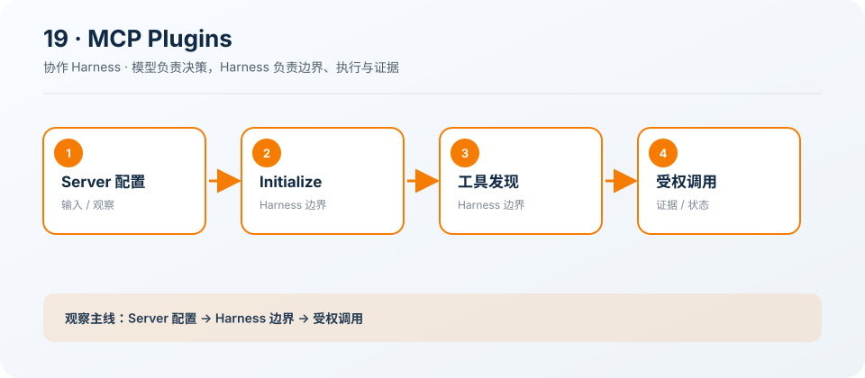

# 19: MCP Plugins — 把外部能力接入同一工具池

[← s18](../s18_git_worktree/README.md) · [课程地图](../README.md) ·
[s20 →](../s20_comprehensive/README.md)

> “协议扩展能力，但不会自动带来信任”
>
> Harness 层：MCP。本章只增加一个机制，Agent 的核心决策循环保持不变。

## 本章目标

学完后，你应该能解释这个机制解决的具体问题、指出它插入 Agent Loop
的位置，并能修改一个约束后验证行为变化。

## 问题

为每个外部服务手写客户端和工具分支会让 Harness 无法扩展，也会产生不一致的权限语义。

## 解决方案

从工作区配置发现 Server，完成初始化与 Session 管理，再按需 tools/list 和 tools/call。

## 工作原理

1. 限制 HTTPS 或本地 HTTP。
2. 初始化并保存 session id。
3. 按需发现相关工具。
4. 验证并截断外部响应。

### 执行链

```text
config → initialize → tools/list → permission → tools/call
```

模型负责决定下一步，Harness 负责校验、执行、记录和限制。失败也作为观察返回模型，而不是被隐藏。

## 读代码

- 实现：[code.ts](./code.ts)
- 运行：`deno task s19`
- 类型检查：`deno check stages/s19_mcp_plugins/code.ts`

沿着注册点、输入校验、执行函数和 `agentLoop()`
四处阅读。先找到本章新增的状态或工具，再追踪它如何复用前一章。

## 观察清单

连接一个本地 MCP Server，观察 initialize、initialized 通知和 Session Header。

建议同时记录：模型看见了什么 Schema、Harness
实际执行了什么、结果如何回到消息历史，以及取消或失败发生在哪一层。

## 边界与生产差距

MCP 描述、Schema 和结果都是不可信输入；生产还要支持 resources/prompts、认证、重连、关闭、STDIO
与能力刷新。

课程代码为了突出机制会使用简化存储、协议或策略。不要把它直接导入 `src/`；迁移时应围绕生产
Registry、Runtime 和 Feature 契约重新实现。

## 动手练习

1. 修改一个预算、状态或校验条件，预测行为后再运行验证。
2. 构造一个失败输入，确认错误有界、可观察，且不会破坏已完成状态。
3. 写出该机制迁移到生产 `HarnessFeature` 时需要的输入、事件、权限类别和取消路径。

## 过关标准

- 能不看代码画出上面的执行链。
- 能运行本章并解释一次关键事件或工具结果。
- 能说清教学简化与生产边界，而不是只描述“功能能用”。

## 下一章

进入 [s20 →](../s20_comprehensive/README.md)，在同一个 Loop 上继续增加下一项能力。

## 课程图



图中把本章新增机制放在统一 Agent Loop
的边界上；阅读代码时，沿箭头核对输入、执行、限制和证据是否一致。
