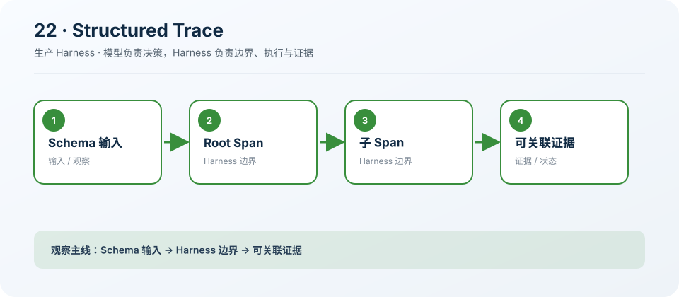

# 22: Structured Contracts & Trace — 让边界可验证

[← s21](../s21_bounded_runtime/README.md) · [课程地图](../README.md) ·
[s23 →](../s23_evaluation_feedback/README.md)

> “Schema 和 Trace 必须贯穿所有边界”
>
> 生产层：契约与追踪。本章把前二十课的教学机制收紧为可执行、可观察、可验收的约束。

## 本章目标

学完后，你应该能说明该能力为什么属于生产
Harness、它依赖哪些证据，以及缺少哪项检查时必须阻断迁移或发布。

## 问题

无结构输入让错误延迟到执行深处；没有统一 Trace 时，UI、模型、工具和 Worker 的一次任务无法关联。

## 解决方案

先验证输入，再让同一个 traceId 贯穿父子 Span，并在 finally 中记录耗时。

## 工作原理

1. 在边界执行运行时校验。
2. 根 Span 建立 traceId。
3. 子 Span 记录 parent。
4. 成功和失败都完成 Span。

### 执行链

```text
input schema → root span → provider/tool spans → bounded output
```

这里的类和函数是可运行的最小模型，用来暴露状态机与边界；它们不是生产服务的替代品。

## 读代码

- 实现：[code.ts](./code.ts)
- 运行：`deno task s22`
- 类型检查：`deno check stages/s22_structured_tracing/code.ts`

先读导出的类型与纯函数，再看课程工具如何构造一个最小示例，最后追踪 Prompt Section 如何把原则加入统一
Harness。

## 观察清单

让工具成功和抛错各运行一次，确认两条路径都留下完整 Span，且 parent 关系正确。

观察时要区分“示例返回了正确
JSON”和“生产系统具备持久化、并发、安全、取消与运营证据”这两个完全不同的结论。

## 边界与生产差距

生产需要真正的输入/输出 Schema、稳定事件关联、Token/成本/权限属性和导出前脱敏，而非只记录毫秒数。

生产迁移必须通过 `AgentRuntime`、`ToolRegistry`、`PromptRegistry` 和独立 `HarnessFeature`
完成；禁止从 `src/` 或 `desktop/` 直接导入课程代码。

## 动手练习

1. 修改一个阈值或状态转移，写下预期结果并运行本章验证。
2. 增加一个负例，确认失败会留下可定位证据，而不是被吞掉或误报成功。
3. 把本章机制映射到生产模块，列出契约、持久化、权限、Trace、取消和回滚要求。

## 过关标准

- 能画出执行链并解释每个边界由谁强制。
- 能指出示例中的占位实现和至少三项生产缺口。
- 能给出一条可自动化的验收证据，而不是“人工看起来没问题”。

## 下一章

进入 [s23 →](../s23_evaluation_feedback/README.md)，继续补齐生产 Agent 的下一层约束。

## 课程图



图中把本章新增机制放在统一 Agent Loop
的边界上；阅读代码时，沿箭头核对输入、执行、限制和证据是否一致。
