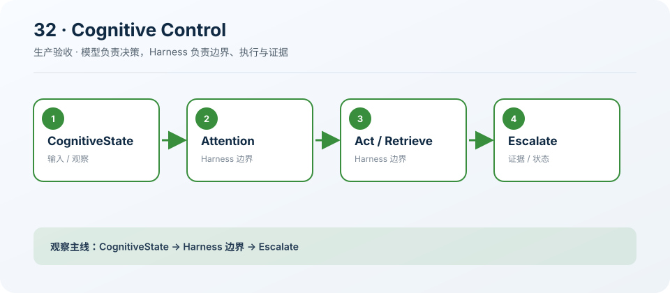

# 32: Cognitive Control — 根据信号选择策略

[← s31](../s31_structured_io/README.md) · [课程地图](../README.md) ·
[s33 →](../s33_flow_handoff_guardrails/README.md)

> “推理策略要按需路由，不要全部叠加”
>
> 生产层：认知控制。本章把前二十课的教学机制收紧为可执行、可观察、可验收的约束。

## 本章目标

学完后，你应该能说明该能力为什么属于生产
Harness、它依赖哪些证据，以及缺少哪项检查时必须阻断迁移或发布。

## 问题

固定使用同一种推理方式会在知识缺口、矛盾或停滞时重复无效动作；把所有策略同时启用又浪费成本。

## 解决方案

用 CognitiveState 的置信度、矛盾、知识缺口和停滞信号选择 act、retrieve、pivot 或 escalate。

## 工作原理

1. 收集可观察认知信号。
2. attention 选择单一路由。
3. 执行对应策略。
4. 保存证据与策略结果供下轮判断。

### 执行链

```text
state → attention → act/retrieve/pivot/escalate → evidence
```

这里的类和函数是可运行的最小模型，用来暴露状态机与边界；它们不是生产服务的替代品。

## 读代码

- 实现：[code.ts](./code.ts)
- 运行：`deno task s32`
- 类型检查：`deno check stages/s32_reasoning_strategies/code.ts`

先读导出的类型与纯函数，再看课程工具如何构造一个最小示例，最后追踪 Prompt Section 如何把原则加入统一
Harness。

## 观察清单

分别构造低置信度、知识缺口和连续停滞状态，验证路由决策。

观察时要区分“示例返回了正确
JSON”和“生产系统具备持久化、并发、安全、取消与运营证据”这两个完全不同的结论。

## 边界与生产差距

生产信号必须来自评估与环境证据，认知模块应是可移除 Feature，不能创建第二个无界 Agent Loop。

生产迁移必须通过 `AgentRuntime`、`ToolRegistry`、`PromptRegistry` 和独立 `HarnessFeature`
完成；禁止从 `src/` 或 `desktop/` 直接导入课程代码。

## 动手练习

1. 修改一个阈值或状态转移，写下预期结果并运行本章验证。
2. 增加一个负例，确认失败会留下可定位证据，而不是被吞掉或误报成功。
3. 把本章机制映射到生产模块，列出契约、持久化、权限、Trace、取消和回滚要求。

## 过关标准

- 能画出执行链并解释每个边界由谁强制。
- 能指出示例中的占位实现和至少三项生产缺口。
- 能给出一条可自动化的验收证据，而不是“人工看起来没问题”。

## 下一章

进入 [s33 →](../s33_flow_handoff_guardrails/README.md)，继续补齐生产 Agent 的下一层约束。

## 课程图



图中把本章新增机制放在统一 Agent Loop
的边界上；阅读代码时，沿箭头核对输入、执行、限制和证据是否一致。
