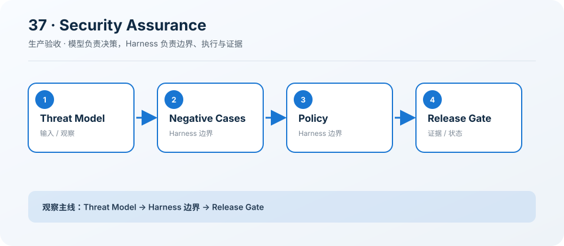

# 37: Security Assurance — 用负例证明边界

[← s36](../s36_deploy_worker_queue/README.md) · [课程地图](../README.md) ·
[s38 →](../s38_cost_latency_routing/README.md)

> “正向成功不能证明系统安全”
>
> 生产层：红队。本章把前二十课的教学机制收紧为可执行、可观察、可验收的约束。

## 本章目标

学完后，你应该能说明该能力为什么属于生产
Harness、它依赖哪些证据，以及缺少哪项检查时必须阻断迁移或发布。

## 问题

功能测试只证明合法请求能工作，无法发现 Prompt Injection、SSRF、秘密外泄或参数注入绕过。

## 解决方案

把威胁模型转成持续运行的 ThreatCase，并让任何关键负例失败都阻断发布。

## 工作原理

1. 枚举资产、入口与信任边界。
2. 为攻击编写期望 deny。
3. 运行策略并记录脱敏结果。
4. 把失败接入 Release Gate。

### 执行链

```text
threat model → negative cases → policy/runtime → red-team report → release gate
```

这里的类和函数是可运行的最小模型，用来暴露状态机与边界；它们不是生产服务的替代品。

## 读代码

- 实现：[code.ts](./code.ts)
- 运行：`deno task s37`
- 类型检查：`deno check stages/s37_security_governance/code.ts`

先读导出的类型与纯函数，再看课程工具如何构造一个最小示例，最后追踪 Prompt Section 如何把原则加入统一
Harness。

## 观察清单

加入编码绕过、多轮社会工程和 localhost 变体，检查当前简单策略会漏掉什么。

观察时要区分“示例返回了正确
JSON”和“生产系统具备持久化、并发、安全、取消与运营证据”这两个完全不同的结论。

## 边界与生产差距

正则示例只用于教学；红队补充而不替代 IAM、沙箱、网络隔离、密钥管理和人工审批。

生产迁移必须通过 `AgentRuntime`、`ToolRegistry`、`PromptRegistry` 和独立 `HarnessFeature`
完成；禁止从 `src/` 或 `desktop/` 直接导入课程代码。

## 动手练习

1. 修改一个阈值或状态转移，写下预期结果并运行本章验证。
2. 增加一个负例，确认失败会留下可定位证据，而不是被吞掉或误报成功。
3. 把本章机制映射到生产模块，列出契约、持久化、权限、Trace、取消和回滚要求。

## 过关标准

- 能画出执行链并解释每个边界由谁强制。
- 能指出示例中的占位实现和至少三项生产缺口。
- 能给出一条可自动化的验收证据，而不是“人工看起来没问题”。

## 下一章

进入 [s38 →](../s38_cost_latency_routing/README.md)，继续补齐生产 Agent 的下一层约束。

## 课程图



图中把本章新增机制放在统一 Agent Loop
的边界上；阅读代码时，沿箭头核对输入、执行、限制和证据是否一致。
